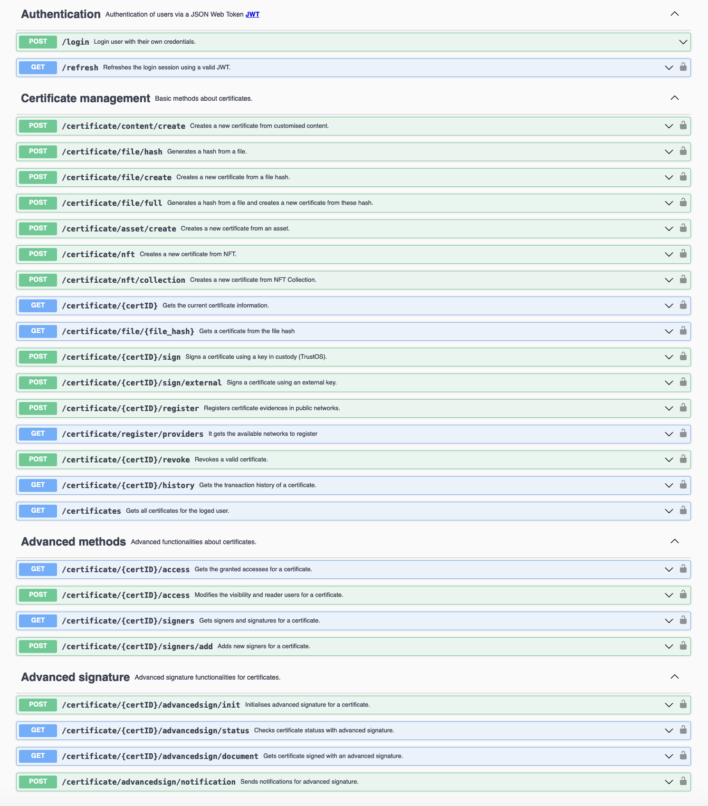

# Cert

Cert API is used to create, sign and verify **digital certificates** on the blockchain. The entire functionalities are based on a Smart Contract that handles the lifecycle of every certificate in the most autonomous and secure way.

## API Specification

An abstraction API with all the certificate functionalities

### Certificate

A certificate is a tamper-proof and verifiable collection of data that represents a process, a file/document, an accomplishment or any activity that can benefit from the inmmutability and authenticity.

Thanks to certificates, it allows you to **assure any fact in your business case recording the information along with parameters that everyone can verify** (e.g. signatures, issuance/expiration time, network evidences, etc..). 

Every certificate is identified by a unique ID and is composed of three complementary but different parts: Data, Metadata and Access.


Thus a certificate has the following structure:
- `certID` :  `<string>` Unique identifier of the certificate 
- `data`    :  `<json>`   JSON of certificate data that is inmutable
- `metadata`:  `<json array>` Array of transactions that feed the certificate (e.g. verification instructions, signatures, revocation and public registration)
- `access` :  `<json>` JSON of granted accesses to interact with the certificate (e.g. admin, sign, read access)
<details>
  <summary><em><strong>Sample Certificate structure</strong></em> (Click to expand)</summary>

```js
{
  "certID": "...",
  "data": {},
  "metadata": [],
  "access": {}
}
```
</details> 
<br/>


#### <u>Certificate data</u>

Data contains the **inmutable information about the certificate**: who issued it, when it was issued, when it will expire and of course what it is certified and what does it mean.

The certificate `data` contains the following fields:
- `badge` :  `<json>` JSON of **badge information** that characterises the certificate (e.g. name, description, type, content, issuer)
- `issuedOn` :  `<date>` Datetime of when the certificate is issued
- `expires` :  `<date>` Datetime of when the certificate should no longer be considered valid
- `hash` :  `<string>` Hash of the data information

<details>
  <summary><em><strong>Sample Data structure</strong></em> (Click to expand)</summary>

```js
{
  "badge":{
      "certID": "...",
      "name": "...",
      "description": "...",
      "type": "...",            // Type should be: content / asset
      "content": [],            // Content to certify
      "issuer": "did:vtn:admin"
  },
  "issuedOn": "2020-11-12 12:00:34 +0000 UTC",
  "expires": "2021-12-31 23:59:59 +0000 UTC",
  "hash": "Ni7JYQG6GSmlEjWoRj2xrfF6ZVFhqBDPzyjk+o/HB2c="
}
```
</details> 
<br/>


#### <u>Certificate metadata</u>

Metadata contains the **additional information that feeds the certificate** in order to update the status of the certificate (e.g. revocation, evidences) or to add required data to be valid and know how to verify it (e.g. verification, signers, signatures)

The certificate `metadata` contains the following fields:
- `certID` :  `<string>` Unique identifier of the certificate 
- `type` : `<string>` Type of transaction (Signature/Revocation/Evidence/Adding signers)
- `verification` :  `<json>` JSON of **verification information**. It contains the required signers
- `signatures` :  `<json>` JSON of **signatures** added for the verification of the certificate
- `public_evidences` :  `<json>` JSON of **certificate evidences** registered in public networks, private databases and other sites
- `revoked` :  `<bool>` Flag to determine that the certificate is revoked and is not longer valid
- `datetime` :  `<string>` Datetime of when the transaction (signature, evidence or revocation) is done 
- `hfTxId` :  `<string>` Current transaction identifier in Hyperledger Fabric
- `hash` :  `<string>` Hash of the transaction

<details>
  <summary><em><strong>Sample Metadata structure</strong></em> (Click to expand)</summary>

```js
{
  "certID": "...",
  "type": "Signature/Revocation/Evidence/Adding signers",
  "verification": {
      "type":"SignedBadge",
      "signers": []              // List of required signers
  },
  "signatures": {},              // Collection of signatures
  "public_evidences": {},        // Collection of evidences
  "revoked": false,
  "datetime": "1592568489",
  "hfTxId": "3ae1d6b0f914aee4ce7105ddd65c4cf2dcf160ca398297a13032aaf33b50ed291",
  "hash": "oRj6yKH4EDGCGiKRjHzv3yuqX5wAEzwZFgLnE9jwRIs="
}
```
</details> 
<br/>

#### <u>Certificate access</u>
Access contains **list of authorised users depending on their role** (i.e. admin, sign, read) for a certificate in order to control the possible interaction of every user 

The certificate `access` contains the following fields:
- `admin` :  `<json>` Json of **admin**. An admin can manage, sign and revoke the certificate
- `sign` :  `<json>` Json of **readers**. A signer can sign only once and read the certificate
- `read` :  `<json>` Json of **readers**. A reader can only read and verify the certificate
- `public` :  `<bool>` Flag to determine whether the certificate is public and readable for all users or not

<details>
  <summary><em><strong>Sample Access structure</strong></em> (Click to expand)</summary>

```js
{
  "admin":{
    "did:vtn:admin": 1
  },
  "sign":{
    "did:vtn:signer1": 1,  // Signer has not signed yet
    "did:vtn:signer2": 0   // Signer has already signed
  },
  "read":{
    "did:vtn:reader1": 1,  
    "did:vtn:reader2": 1  
  },
  "public": false         // The certificate is not visible for all
}
```
</details> 
<br/>

## API Methods 



<details>
  <summary><em><strong>API methods</strong></em> (Click to expand)</summary>

---

####     POST -  `/certificate/content/create` 
Create a certificate from a specific content like file/document/collection of files on Blockchain. 
A unique and irrevocable identifier (`certID`) is generated for every certificate.

<u>*Input*</u>
- `name`    :  `<string>` Name of the certificate
- `description`    :  `<string>` Short description of the certificate
- `content`    :  `<json>` Content to certify (*)
- `public`    :  `<bool>`  Flag to determine whether the certificate is public and readable for all users or not
- `readers`    :  `<string array>` List of readers, in case it is not public 
- `signers`    :  `<string array>` List of required signers
- `expires`   : `<string>` Optional parameter to determine the expiration of the certificate in `2020-12-18 09:59:13 +0000 UTC` format, similar to ISO 8601


<details>
  <summary><em><strong>Sample structure</strong></em> (Click to expand)</summary>

```js
{
  "name": "ABC Certificate",
  "description": "This certificate is a tamper-proof and valid record of the ABC document file",
  "content": {},   
  "public": false,
  "readers": [
    "did:vtn:reader1",
    "did:vtn:reader2"
  ],
  "signers": [
    "did:vtn:signer1",
    "did:vtn:signer2"
  ]
}
```
</details> 
<br>

(*) **Content** field is JSON format and open for every use case. An example is shown below:

<details>
  <summary><em><strong>Sample Content structure</strong></em> (Click to expand)</summary>

```js
{
  "content":{
    "file_name":"example.pdf",
    "file_hash":"3aAFa39ho53589gbxCSkFj239y90tiFAa78xZAuo=",
    "file_size":"10KB"
  }
}
```

</details> 
<br>

<u>*Output*</u>
- `certificate`    :  `<json>` 

<details>
  <summary><em><strong>Sample structure</strong></em> (Click to expand)</summary>

```js
{
  "output": {
    "certID": "6404b254f008acda6d55f68dee48304fcf36c73cf881cdeff478b7b4a2545248",
    "data": {
        "badge": {
            "certID": "6404b254f008acda6d55f68dee48304fcf36c73cf881cdeff478b7b4a2545248",
            "name": "ABC Certificate",
            "description": "This certificate is a tamper-proof and valid record of the ABC document file",
            "type": "content",
            "content": [
              {
                "file_hash": "3aAFa39ho53589gbxCSkFj239y90tiFAa78xZAuo=",
                "file_name": "example.pdf",
                "file_size": "10KB"
              } 
            ],
            "issuer": "did:vtn:trustid:76ce288f169fdd9b90a2b9b6a11700fbd80123093f3296e235ab10c27eb306c1",
        },
        "issuedOn": "2021-04-28 14:25:06 +0000 UTC"
        "expires": "",
        "hash": "Bs2nFa30Ghu84uwBnjs2aOi53qe6r6YTpjk+o/HB2c="
    },
    "metadata": [
        {
          "verification": {
            "signers":["did:vtn:signer1","did:vtn:signer2"]
          },
          "signatures": null,
          "public_evidences": null,
          "revoked": false
        }
    ],
    "access": {
        "admin": {
            "did:vtn:admin": 1
        },
        "read": {
            "did:vtn:reader1": 1,
            "did:vtn:reader2": 1
        },
        "sign": {
            "did:vtn:signer1": 1,
            "did:vtn:signer2": 1
        },
        "public": false
    }
  }
}
```
</details> 

---

####     POST -  `/certificate/asset/create` 
Create a certificate from a file/document/collection of files on Blockchain. 
A unique and irrevocable identifier (`certID`) is generated for every certificate

<u>*Input*</u>
- `name`    :  `<string>` Name of the certificate
- `description`    :  `<string>` Short description of the certificate
- `assetID`    :  `<string>` Asset to certify (*)
- `public`    :  `<bool>`  Flag to determine whether the certificate is public and readable for all users or not
- `readers`    :  `<string array>` List of readers, in case it is not public 
- `signers`    :  `<string array>` List of required signers


<details>
  <summary><em><strong>Sample structure</strong></em> (Click to expand)</summary>

```js
{
  "name": "Asset Certificate",
  "description": "This certificate is a tamper-proof and valid record of the process",
  "assetID": "asset_example1",   
  "public": false,
  "readers": [
    "did:vtn:reader1",
    "did:vtn:reader2"
  ],
  "signers": [
    "did:vtn:signer1",
    "did:vtn:signer2"
  ]
}
```
</details> <br/>
 

(*) **assetID** field is used for certify assets created with Track API. If you have already created some assets (f.e. asset_example1, asset_example2, asset_example3) you can choose what asset to certify and also what range of its transactions.

If wanted to certify only transactions within a period or range of time, only you have to determine `init` and `end` params as depicted below:

<details>
  <summary><em><strong>Sample of asset range certificate</strong></em> (Click to expand)</summary>

```js
{
 
  "name": "Asset Certificate",
  "description": "This certificate is a tamper-proof and valid record of the process",
  "assetID": "asset_example1",   
  "init": "1600000000",
  "end":"1615555555"
  "public": true
} 
```
</details> 

<br>

<u>*Output*</u>
- `certificate`    :  `<json>` 

<details>
  <summary><em><strong>Sample structure</strong></em> (Click to expand)</summary>

```js
{
  "output": {
    "certID": "6404b254f008acda6d55f68dee48304fcf36c73cf881cdeff478b7b4a2545248",
    "data": {
        "badge": {
            "name": "ABC Certificate",
            "description": "This certificate is a tamper-proof and valid record of the process",
            "type": "asset",
            "content": [ array of asset transactions ]
        },
        "issuedOn": "2021-04-28 14:25:06 +0000 UTC"
        "expires": "",
        "hash": "Bs2nFa30Ghu84uwBnjs2aOi53qe6r6YTpjk+o/HB2c="
    },
    "metadata": [
        {
          "verification": {
            "signers":["did:vtn:signer1","did:vtn:signer2"]
          },
          "signatures": null,
          "public_evidences": null,
          "revoked": false
        }
    ],
    "access": {
        "admin": {
            "did:vtn:admin": 1
        },
        "read": {
            "did:vtn:reader1": 1,
            "did:vtn:reader2": 1
        },
        "sign": {
            "did:vtn:signer1": 1,
            "did:vtn:signer2": 1
        },
        "public": false
    }
  }
}
```
</details> 

---

####    GET     -   `/certificate/{certID}`  


Get certificate from the blockchain

<u>*Input*</u>
- `certID` :  `<string>` Unique identifier of the certificate
  
<u>*Output*</u>
- `certificate`    :  `<json>` 

<details>
  <summary><em><strong>Sample structure</strong></em> (Click to expand)</summary>

```js
{
  "output": {
    "access": {
      "admin": {
        "did:vtn:trustid:76ce288f169fdd9b90a2b9b6a11700fbd80123093f3296e235ab10c27eb306c1": 1
      },
      "read": {
        "did:vtn:reader1": 1,
        "did:vtn:reader2": 1
      },
      "sign": {
        "did:vtn:signer1": 1,
        "did:vtn:signer2": 1
      }
    },
    "certID": "6404b254f008acda6d55f68dee48304fcf36c73cf881cdeff478b7b4a2545248",
    "data": {
      "badge": {
        "certID": "6404b254f008acda6d55f68dee48304fcf36c73cf881cdeff478b7b4a2545248",
        "content": [
          {
            "file_hash": "3aAFa39ho53589gbxCSkFj239y90tiFAa78xZAuo=",
            "file_name": "example.pdf",
            "file_size": "10KB"
          }
        ],
        "description": "This certificate is a tamper-proof and valid record of the ABC document file",
        "issuer": "did:vtn:trustid:76ce288f169fdd9b90a2b9b6a11700fbd80123093f3296e235ab10c27eb306c1",
        "name": "ABC Certificate",
        "type": "content"
      },
      "expires": "",
      "hash": "I6fI6JPNS9y3QGfACbZkAVTOGr5060Y3JF2b/Tl2TCY=",
      "issuedOn": "2021-04-28 14:25:06 +0000 UTC"
    },
    "metadata": [
      {
        "public_evidences": null,
        "revoked": false,
        "signatures": null,
        "verification": {
          "signers": [
            "did:vtn:signer1",
            "did:vtn:signer2"
          ],
          "type": "SignedBadge"
        }
      }
    ]
  }
}
```
</details> 

---

####     POST -  `/certificate/{certID}/sign` 
Sign a certificate 

<u>*Input*</u>
- `certID` :  `<string>` Unique identifier of the certificate

<u>*Output*</u>
- `certificate`    :  `<json>` 

<details>
  <summary><em><strong>Sample structure</strong></em> (Click to expand)</summary>

```js
{
  "output": {
    "datetime": "2021-04-28 14:42:42 +0000 UTC",
    "hfTxId": "0a55b28d171bfdbadc2f3e92cae89a998ed9531267c658dd1bd658004fa98df7",
    "signature": "eyJjdHkiOiJqd2sranNvbiIsImFsZyI6IlJTMjU2Iiwia2lkIjoidS1MWnp5RnprNEMyOUNkdjh2T1pVd0tXSlo4WUxJdmZxbXk5VHkza041TSJ9.eyJwYXlsb2FkIjp7ImJhZGdlIjp7ImNlcnRJRCI6IjY0MDRiMjU0ZjAwOGFjZGE2ZDU1ZjY4ZGVlNDgzMDRmY2YzNmM3M2NmODgxY2RlZmY0NzhiN2I0YTI1NDUyNDgiLCJjb250ZW50IjpbeyJmaWxlX2hhc2giOiIzYUFGYTM5aG81MzU4OWdieENTa0ZqMjM5eTkwdGlGQWE3OHhaQXVvPSIsImZpbGVfbmFtZSI6ImV4YW1wbGUucGRmIiwiZmlsZV9zaXplIjoiMTBLQiJ9XSwiZGVzY3JpcHRpb24iOiJUaGlzIGNlcnRpZmljYXRlIGlzIGEgdGFtcGVyLXByb29mIGFuZCB2YWxpZCByZWNvcmQgb2YgdGhlIEFCQyBkb2N1bWVudCBmaWxlIiwiaXNzdWVyIjoiZGlkOnZ0bjp0cnVzdGlkOjc2Y2UyODhmMTY5ZmRkOWI5MGEyYjliNmExMTcwMGZiZDgwMTIzMDkzZjMyOTZlMjM1YWIxMGMyN2ViMzA2YzEiLCJuYW1lIjoiQUJDIENlcnRpZmljYXRlIiwidHlwZSI6ImNvbnRlbnQifSwiZXhwaXJlcyI6IiIsImhhc2giOiJJNmZJNkpQTlM5eTNRR2ZBQ2Jaa0FWVE9HcjUwNjBZM0pGMmIvVGwyVENZPSIsImlzc3VlZE9uIjoiMjAyMS0wNC0yOCAxNDoyNTowNiArMDAwMCBVVEMifX0.kt1yX2MRxMGL4rZqokxxFQy5AcUNP4824VFTEFf-W7DoExYNeh-xKl1oIwiJKRdO6WIGMIiDPPwd2l0WT3m8jdsy6KMyHMGzimG3GoQUTBLd4lTPjQL-93f5OkLQJqut77iX2lVblI3HmvLdV_Vx7-IqFwIFszaULHh8TJzxNCFXOy9MpJhUUfk0abExK_2NaYlvif6y6WeQ1pCrjoOi7fnO0mSzyVXhvlRB2WTXLjJ4cD-lsljdg91KRcnFucoWZu9sQYpt6Gv_rvKPJaejeGCGGjqUEifXwEHBEP6soRLyvcM1TF5TDql03xTd4chP4GDC0uTMXJwNpiX9GyTe6g",
    "signer": {
      "controller": "did:vtn:trustid:76ce288f169fdd9b90a2b9b6a11700fbd80123093f3296e235ab10c27eb306c1",
      "id": "did:vtn:trustid:76ce288f169fdd9b90a2b9b6a11700fbd80123093f3296e235ab10c27eb306c1",
      "publicKey": "-----BEGIN PUBLIC KEY-----MIIBIjANBgkqhkiG9w0BAQEFAAOCAQ8AMIIBCgKCAQEAtxqRLjAv2spWbBzjqi8uM+mgNo0EbYSbulfUM2BwcAuCi3+lD+Z8Te7FdtLwXxNFyK6D3tDY3F0VCx9AbaaZujzP3QuLX4HwV6hk3v/ut+ArK45l1ZhyEKURYQ92rQBZMwWkRw4G0bTrSS7f/8OH2V+/9LO8SpeZKhOoY15wGBZbO+OTk2nl03SkbcLe2QugnZ3CXXYU6LPfU4P2HgeugZXF+HwGBWJWMG6mwpKGRX9ba8qzyZMJ0xKUx60CYMUzksK480MfFGl6ifV24u/+EprVXIdVdtizbxbgNH/PomFqgfyObJMSNaNw8odj52NEFwvfy7UbM90Sm693IiVE7wIDAQAB-----END PUBLIC KEY-----"
    },
    "type": "SignedBadge"
  }
}
```
</details> 

---

####     POST -  `/certificate/{certID}/sign/external` 
Sign a certificate with external identity and keys

<u>*Input*</u>
- `certID` :  `<string>` Unique identifier of the certificate
- `signature`    :  `<string>` Signature 
- `publicKey`    :  `<string>` External public key to verify the signature
- `did`    :  `<string>` Signer DID identifier or internal identifier

<details>
  <summary><em><strong>Sample structure</strong></em> (Click to expand)</summary>

```js
{
  "signature": "eyJSosd289ap389fa8uf3u8u4er8912rz....",
  "publicKey": "--------BEGIN PUBLIC KEY-------- ... --------END PUBLIC KEY--------",
  "did": "did:external:signer3"
}
```

</details> 
<br>

<u>*Output*</u>
- `certificate`    :  `<json>` 

<details>
  <summary><em><strong>Sample structure</strong></em> (Click to expand)</summary>

```js
{
  "output": {
    "datetime": "2021-04-28 14:45:34 +0000 UTC",
    "hfTxId": "42dab150121afe3db840101e5b648fa0f7e3413248314a018ef28ebef63e82d8",
    "signature": "eyJSosd289ap389fa8uf3u8u4er8912rz...",
    "signer": {
        "controller": "did:vtn:trustid:76ce288f169fdd9b90a2b9b6a11700fbd80123093f3296e235ab10c27eb306c1",
        "id": "did:external:signer3",
        "publicKey": "-----BEGIN PUBLIC KEY----- ... -----END PUBLIC KEY-----"
    },
    "type": "SignedBadge"
  }
}
```
</details> 

---


####     POST -  `/certificate/{certID}/register` 
Register a certificate evidence in public network

<u>*Input*</u>
- `certID` :  `<string>` Unique identifier of the certificate
- `network`    :  `<string>` Network to register the certificate evidence. Only available: Ethereum

<details>
  <summary><em><strong>Sample structure</strong></em> (Click to expand)</summary>

```js
{
  "network": "Ethereum"
}
```
</details> 
<br>

<u>*Output*</u>
- `certificate`    :  `<json>` 

<details>
  <summary><em><strong>Sample structure</strong></em> (Click to expand)</summary>

```js
{
  "output": {
      "datetime": "2021-04-28 14:46:53 +0000 UTC",
      "hash": "kKI+m663XKazuZ+Orbt/oCQp5rAQJQ7kjYwpqNMnMy4=",
      "hfTxId": "0b9743f8ae6529b4c3bb051202568598facb29227c8d819047db4a63452df37c",
      "type":"Evidence",
      "verification":{...},
      "signatures": {...},
      "public_evidences": {
        "ethereum": {
            "evidenceHash": "I6fI6JPNS9y3QGfACbZkAVTOGr5060Y3JF2b/Tl2TCY=",
            "smartContract": "0x0C9114b9Ec58d1fbF9FC650BE4B7Aefe481597A0",
            "timestamp": 1619621204,
            "transaction": "0x331bf9fd1514cb41434c594b18f4b848783b3807004ebd68c9ca73a77c7ee48b"
          }
      },
      "revoked": false
    }
}
```
</details> 

---

####     POST -  `/certificate/{certID}/revoke` 
Revoke a certificate 

<u>*Input*</u>
- `certID` :  `<string>` Unique identifier of the certificate

<u>*Output*</u>
- `certificate`    :  `<json>` 

<details>
  <summary><em><strong>Sample structure</strong></em> (Click to expand)</summary>

```js
{
  "output": {
      "datetime": "2021-04-28 14:48:51 +0000 UTC",
      "hash": "NeeF0whDLcqkq4I8e5p9Yuiz7UZ2UVu68LZvIsBJhg8=",
      "hfTxId": "20b750b8b54dd81d95177048d185ecc17a5ba42ac5351b8915d59d99c2c77967",
      "type": "Revocation",
      "signatures": {...},
      "public_evidences": {...},
      "revoked": true
      }
}
```
</details> 

--- 

####   GET  -     `/certificate/{certID}/history`  

Get all transactions for the whole lifecycle of the certificate

<u>*Input*</u>
- `certID` :  `<string>` Unique identifier of the certificate

<u>*Output*</u>
- `Certificate transactions`    :  `<string>` A list of all transactions

<details>
  <summary><em><strong>Sample structure</strong></em> (Click to expand)</summary>

```js
{
  "output": {
    "certID": "6404b254f008acda6d55f68dee48304fcf36c73cf881cdeff478b7b4a2545248",
    "data": {
      "badge": {
        "certID": "6404b254f008acda6d55f68dee48304fcf36c73cf881cdeff478b7b4a2545248",
        "name": "ABC Certificate",
        "description": "This certificate is a tamper-proof and valid record of the ABC document file",
        "issuer": "did:vtn:trustid:76ce288f169fdd9b90a2b9b6a11700fbd80123093f3296e235ab10c27eb306c1",
        "type": "content",
        "content": [...]
      },
      "issuedOn": "2025-12-31T23:59:59+00:00",
      "expires": "",
    },
    "metadata": [
      {
      "datetime": "2021-04-28 14:48:51 +0000 UTC",
      "hash": "NeeF0whDLcqkq4I8e5p9Yuiz7UZ2UVu68LZvIsBJhg8=",
      "hfTxId": "20b750b8b54dd81d95177048d185ecc17a5ba42ac5351b8915d59d99c2c77967",
      "type": "Revocation",
      "verification": {...},
      "signatures": {...},
      "public_evidences": {...},
      "revoked": true
    },
    {
      "datetime": "2021-04-28 14:46:53 +0000 UTC",
      "hash": "kKI+m663XKazuZ+Orbt/oCQp5rAQJQ7kjYwpqNMnMy4=",
      "hfTxId": "0b9743f8ae6529b4c3bb051202568598facb29227c8d819047db4a63452df37c",
      "type": "Evidence",
      "verification": {...},
      "signatures": {...},
      "public_evidences": {...},
      "revoked": false
    },
    
      ...
    
    ],
    "access": {...}
  }
}

```
</details>

---

#### GET   -    `/certificates`  

Lists all the certificates of a user

<u>*Input*</u>
 N/A. It returns all the certificates which belong to the login user

<u>*Output*</u>
- `Certificate list`    :  `<json>` 

<details>
  <summary><em><strong>Sample structure</strong></em> (Click to expand)</summary>

```js
{
  "output": {
    "certID": [
      "0520dc4c155c06c5319308f245dffb318b9c9ed3b30cb14f0ded59640d193960",
      "060c60c2b1c6adfcbbff3e3d2cdb01184910998322b5914f91d19d16e063490b",
      "084407ec6851fa7bf0753a51071ca2ba6a65d47085fdb5e47e66c9b7c7c73548",
      "0a1d198ed8a2822fc45cd4e749e4c6c1897046b0e6ccdb4dac4488cbbf71b2d7"
    ]
  }
}
```
</details>

---

####   GET  -     `/certificate/{certID}/access`  

Get all granted accesses for the certificate

<u>*Input*</u>
- `certID` :  `<string>` Unique identifier of the certificate

<u>*Output*</u>
- `Access`    :  `<string>` A list of all accesses

<details>
  <summary><em><strong>Sample structure</strong></em> (Click to expand)</summary>

```js
{
  "output": {
      "admin": {
        "did:vtn:admin": 1
      },
      "read": {
        "did:vtn:reader1": 1,
        "did:vtn:reader2": 1
      },
      "sign": {
        "did:vtn:signer1": 1,
        "did:vtn:signer2": 1
      },
      "public": false
  }
}
```
</details>

---

####   POST     - `/certificate/{certID}/access`  

Authorise the reading access for a certificate. The user has to be the owner (admin) of the certificate. Readers are overwriten in every call

<u>*Input*</u>
- `certID` :  `<string>` Unique identifier of the certificate
- `public`    :  `<bool>`  Flag to determine whether the certificate is public and readable for all users or not
- `readers`    :  `<string array>` List of readers, in case it is not public 

<details>
  <summary><em><strong>Sample structure</strong></em> (Click to expand)</summary>

```js
{
  "output": {
    "public": false,
    "readers": ["did:vtn:reader3","did:vtn:reader4"]
  }
}
```
</details> 
<br>

<u>*Output*</u>
- `Access`    :  `<json>`  A list of all accesses

<details>
  <summary><em><strong>Sample structure</strong></em> (Click to expand)</summary>

```js
{
  "output": {
      "admin": {
        "did:vtn:admin": 1
      },
      "read": {
        "did:vtn:reader3": 1,
        "did:vtn:reader4": 1
      },
      "sign": {
        "did:vtn:signer1": 1,
        "did:vtn:signer2": 1
      },
      "public": false
  }
}
```
</details>

---

####   GET  -     `/certificate/{certID}/signers`  

Get the signers and their signatures for the certificate

<u>*Input*</u>
- `certID` :  `<string>` Unique identifier of the certificate

<u>*Output*</u>
- `Signers`    :  `<string>` A list of all signers with their signature and public key

<details>
  <summary><em><strong>Sample structure</strong></em> (Click to expand)</summary>

```js
{
  "output": {
    "did:vtn:signer1": {},
    "did:vtn:signer2": {}
  }
}
```
</details>


---

####   POST  -     `/certificate/{certID}/signers/add`  

Add new signers to the certificate

*Input*
- `certID` :  `<string>` Unique identifier of the certificate
- `signers`:  `<string array>` List of new signers

<details>
  <summary><em><strong>Sample structure</strong></em> (Click to expand)</summary>

```js
{
  "signers": ["did:vtn:signerNEW", "did:vtn:signerNEW2"]
}
```
</details>

*Output*
- `Metadata`    :  `<json>` A JSON of current metadata information

<details>
  <summary><em><strong>Sample structure</strong></em> (Click to expand)</summary>

```js
{
  "output": {
      "certID": "6404b254f008acda6d55f68dee48304fcf36c73cf881cdeff478b7b4a2545248",
      "type":"Adding signers",
      "verification":{
        "type":"SignedBadge",
        "signers":[
            "did:vtn:signer1",
            "did:vtn:signer2",
            "did:vtn:signerNEW",
            "did:vtn:signerNEW2"
        ]
      },
      "signatures": {...},
      "public_evidences": {...},
      "revoked": false,
      "datetime": "1592568489",
      "hfTxId": "3ae1d6b0f914aee4ce7105ddd65c4cf2dcf160ca398297a13032aaf33b50ed291",
      "hash": "Ni7JYQG6GSmlEjWoRj2xrfF6ZVFhqBDPzyjk+o/HB2c="
    }
}
```
</details>


---

####   POST  -     `/certificate/{certID}/advancedsign/init`  

Initialise advanced signature flow for a certificate 

*Input*
- `certID` :  `<string>` Unique identifier of the certificate
- `platform`:  `<string array>` Third party platform to use for advanced signature
- `signers`:  `<json array>` List of advanced signers that will be part of the advanced signature flow (email, name and internal identifier)

<details>
  <summary><em><strong>Sample structure</strong></em> (Click to expand)</summary>

```js
{
  "platform": "VIDSigner",
  "signers": [
    {
      "email": "signer1@test.com",
      "name": "Signer1 Test",
      "did": "internalID1"
    }, 
    {
      "email": "signer2@test.com",
      "name": "Signer2 Test",
      "did": "internalID2"
    }
  ]
}
```
</details>

*Output*
- `Metadata`    :  `<json>` A JSON of current metadata information

<details>
  <summary><em><strong>Sample structure</strong></em> (Click to expand)</summary>

```js
{
  "output": {
    "datetime": "2021-04-28 14:20:43 +0000 UTC",
    "hash": "jpt8fQ/+Ml71jR1TO5F5aCNAhlB+j69xt1IfJsBu6AY=",
    "hfTxId": "920d649508240961096ba7a4c1a003be90c8ea5566003d1ce73e7200b0f6c57d",
    "type": "Advanced signature VIDSigner",
    "public_evidences": null,
    "revoked": false,
    "signatures": {
      "advanced": {
        "controller": "did:vtn:trustid:31171f9390a4a048e00b7c4691316f362de8d3e3de69eeb0530c9b286a288509",
        "flowID": "6320b607-ae30-4968-9ef9-6a4d2742f68f",
        "platform": "VIDSigner",
        "status": "Pending",
        "type": "AdvancedSignedBadge"
      }
    },
    "verification": {
      "advancedSigners": [
        "internalID1",
        "internalID2"
      ],
      "signers": null,
      "type": "AdvancedSignedBadge"
    }
  }
}
```
</details>

---

####   GET  -     `/certificate/{certID}/advancedsign/status`  

Get the signers and their signatures for the certificate

<u>*Input*</u>
- `certID` :  `<string>` Unique identifier of the certificate

<u>*Output*</u>
- `Status`    :  `<json>` A JSON of status information about the advanced signature flow and the respective signers

<details>
  <summary><em><strong>Sample structure</strong></em> (Click to expand)</summary>

```js
{
  "output": {
    "flowID": "97877dd3-56de-44d1-a38d-be783d01e7eb",
    "AdditionalData": "a82be0e41b91f9de7d76f4974fd747522aac58d3b93e3180ab7676e3b4e33ba2",
    "DocGUI": "97877dd3-56de-44d1-a38d-be783d01e7eb",
    "DocStatus": "Unsigned",
    "Downloaded": false,
    "FileName": "certificate.pdf",
    "Signers": [
      {
        "FormInfo": null,
        "NumberID": "did.vtn.trustid.advancedsigner1",
        "OperationTime": null,
        "RejectionReason": null,
        "SignatureStatus": "Unsigned",
        "SignerGUI": "c8e6cf1b-a296-4046-920d-037b617f6740",
        "SignerName": "Signer1 Test",
        "TypeOfID": "TrustID",
        "UserNoticesInfo": null
      },
      {
        "FormInfo": null,
        "NumberID": "did.vtn.trustid.advancedsigner2",
        "OperationTime": null,
        "RejectionReason": null,
        "SignatureStatus": "Unsigned",
        "SignerGUI": "036c6673-a7e1-476f-9eaf-65b497450a8d",
        "SignerName": "Signer2 Test",
        "TypeOfID": "TrustID",
        "UserNoticesInfo": null
      }
    ]
  }
}
```
</details>

---

####   GET  -     `/certificate/{certID}/advancedsign/document`  

Get the signers and their signatures for the certificate

<u>*Input*</u>
- `certID` :  `<string>` Unique identifier of the certificate

<u>*Output*</u>
- `Document`    :  `<json>` A JSON with the document signed / pending to be signed (`DocContent`) in base64 format and other useful information

<details>
  <summary><em><strong>Sample structure</strong></em> (Click to expand)</summary>

```js
{
  "output": {
    "flowID": "97877dd3-56de-44d1-a38d-be783d01e7eb",
    "AdditionalData": "a82be0e41b91f9de7d76f4974fd747522aac58d3b93e3180ab7676e3b4e33ba2",
    "DocContent": "JVBERi0xLjQKJeLjz9MKNS...",
    "FileName": "certificate.pdf"
  }
}
```
</details>


---

####   POST  -     `/certificate/advancedsign/notification`  

Receive notifications from any advanced signature flow

This method and route requires a special authorization process, don't hesitate to ask us in order to provide you more detailed information.


</details>
<br/>

## How we run the Application
As you could see in the [Architecture](architecture.html) module, all the applications are running on cloud. Through Kubernetes orchestration system the application deployment, scaling and management is an easy and automated task.

## Testing the Application
In postman folder there are the collection and environment to interact and test with the API methods. It is only needed to import them into postman application and know to use the coren-certapi module

Also you can download the files in the links below:

<a href="_static/certapi.collection.json" download> - Postman collection</a>
<br>
<a href="_static/environment.json" download> - Postman environment</a>

## Errors management
  
Cert API errors are managed through the following JSON:
```
{
  "error": {
    "code": "HTTP status code",
    "function": "function in which the error was generated",
    "message": "error description"
  }
}
```

<br/>

