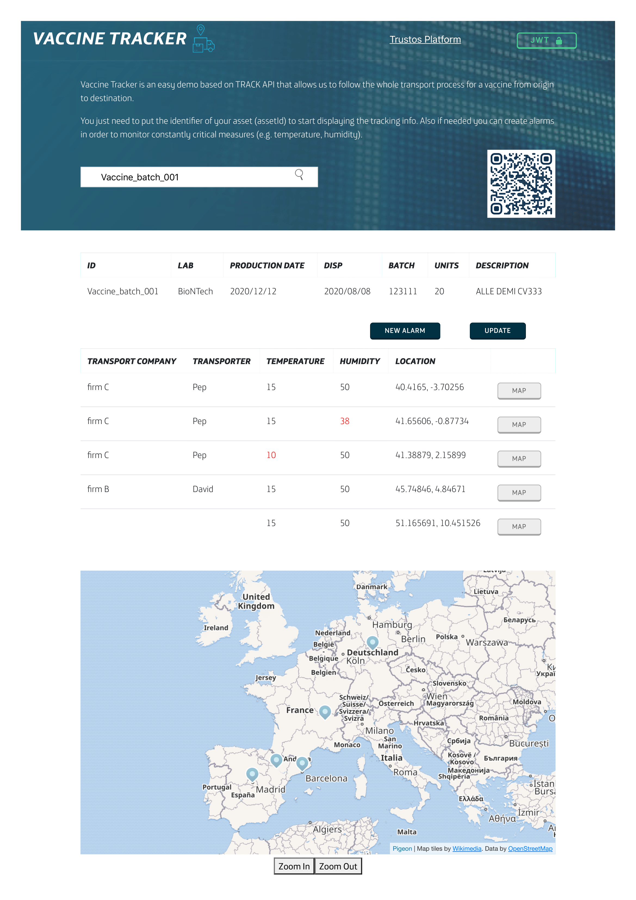

# Demos

In this section you will find snipets of code to make APIs calls to test and see the results for different use case examples. These demo applications allow to understand how easy and fast things are building a new blockchain-based solution or integrating your systems with TrustOS.

## Painting tracker
Painting Tracker is an easy demo based on Track API that allows us to follow the whole transport process for a piece of art from origin to destination.

<details>
  <summary><em><strong>Example JSON structures</strong></em> (Click to expand)</summary>
  <br>

### 1 - Login into the platform
POST - `/login`
```json
{
  "id":"did:vtn:trustid:7474559eb655790c4e6d12200ada51729294432ecec07020015657c7ba2681ec",
  "password":"test"
}
```

### 2 - Create asset: La Gioconda
POST - `/asset/create`
```json
{  
  "assetId": "piece001",
      "data": {
          "title": "La Gioconda",
          "author": "Leonardo Da Vinci",
          "century": "XVI"
      },
      "metadata": {
          "status": "Permanent exhibition - Louvre Museum, Paris",
          "location": "Louvre Museum, Paris",
          "coordinates": "48.8606111, 2.337644"
      }
}
```

### 3 - First update of the asset (transport update 1)
POST - `/asset/{assetId}/update`
```json
{  
  "metadata": {
      "status": "Ceded temporaly - On route",
      "transportCompany": "LDI",
      "transporter": "Antoine",
      "vehicleNumberPlate": "6842DLP",
      "destination": "Burdeos, Francia",
      "coordinates": "44.836151, -0.580816"
  }
}
```

### 4 - Second update of the asset (transport update 2)

POST - `/asset/{assetId}/update`
```json
{  
  "metadata": {
      "status": "Ceded temporaly - On route",
      "transportCompany": "Isys Logistics",
      "transporter": "Alexandre",
      "vehicleNumberPlate": "6842DLP",
      "destination": "Irun, España",
      "coordinates": "43.337814, -1.788811"
  }
}
```

### 5 - Last update of the asset (transport update 3)
POST - `/asset/{assetId}/update`
```json
{
  "metadata": {
      "status": "Ceded temporaly - On route",
      "transportCompany": "Seur",
      "transporter": "Juan Carlos",
      "vehicleNumberPlate": "3246ZUF",
      "destination": "Madrid, España",
      "coordinates": "40.416710, -3.703534"
  }
}
```

### 6 - Demonstrator
Along the transport process all the information is displayed in the Painting Tracker application. You just need to put the identifier of your asset (assetId) to start seeing the whole tracking information.

Endpoint: `/tracker`

Input (assetId): <input value="piece001"></input>

</details>
<br>
<details>
  <summary><em><strong>Front-end demo</strong></em> (Click to expand)</summary>
  <br>
  
-  Tracking view


</details>
<br>

## Vaccine tracker
Vaccine Tracker is an easy demo based on Track API that allows us to follow the whole transport process for a vaccine from origin to destination and to monitor constantly critical measures (e.g temperature, humidity)

<details>
  <summary><em><strong>Example JSON structures</strong></em> (Click to expand)</summary>
  <br>

### 1 - Login into the platform
POST - `/login`
```json
{
  "id":"did:vtn:trustid:7474559eb655790c4e6d12200ada51729294432ecec07020015657c7ba2681ec",
  "password":"test"
}
```
### 2 - Create asset: Vaccine batch
POST - `/asset/create`
```json
{
   "assetId":"Vaccine_batch_001",
   "data":{
      "lab":"BioNTech",
      "date":"2020/12/12",
      "disp":"2020/08/08",
      "batch":"123111",
      "units":"20",
      "description":"ALLE DEMI CV333"
   },
   "metadata":{
      "location":"51.165691, 10.451526",
      "ref":"Germany",
      "temperature":"15",
      "humidity":50
   }
}
```
### 3 - Add rules: Temperature and humidity measures
POST - `/asset/{assetId}/rules`
```json
{
   "rules":{
      "value":[
        {
         "param":"temperature",
         "value":"15"
        }
      ],
      "range":[
        {
         "param":"humidity",
         "min":40,
         "max":60
        }
      ]
   }
}
```

### 4 - Update asset (first transport update - Lyon)
POST - `/asset/{assetId}/update`
```json
{   
  "metadata":{
      "location":"45.74846, 4.84671",
      "ref":"Lyon",
      "temperature":"15",
      "humidity":50,
      "transportCompany":"firm B",
      "transporter":"David"
   }
}
```

### 5 - Update asset (transport update with TEMPERATURE ALARM - Barcelona)
POST - `/asset/{assetId}/update`
```json
{   
  "metadata":{
      "location":"41.38879, 2.15899",
      "ref":"Barcelona",
      "temperature":"10",
      "humidity":50,
      "transportCompany":"firm C",
      "transporter":"Pep"
   }
}
```

### 6 - Update asset (transport update with HUMIDITY ALARM - Zaragoza)
POST - `/asset/{assetId}/update`
```json
{   
  "metadata":{
      "location":"41.65606, -0.87734 ",
      "city":"Zaragoza",
      "temperature":"15",
      "humidity":38,
      "transportCompany":"firm C",
      "transporter":"Pep"
   }
}
```

### 7 - Update asset (last transport update - Madrid)
POST - `/asset/{assetId}/update`
```json
{   
  "metadata":{
      "location":"40.4165, -3.70256 ",
      "ref":"Madrid",
      "temperature":"15",
      "humidity":50,
      "transportCompany":"firm C",
      "transporter":"Pep"
   }
}

```
### 8 - Demonstrator
Along the transport process all the information is displayed in the Vaccine Tracker application. You just need to put the identifier of your asset (assetId) to start seeing the whole tracking information. Moreover, the application is connected to a WebSocket channel in order to listen and monitor all the critical measures that are out of the range or value stablished (e.g temperature and humidity). Every new alarm is displayed as a notification.

Endpoint: `/tracker/vaccine`

Input (assetId): <input value="piece001"></input>


</details><br>
<details>
  <summary><em><strong>Front-end demo</strong></em> (Click to expand)</summary>
  <br>

- Tracking & monitoring view



</details><br>

<details open>
  <summary><em><strong>Video</strong></em> (Click to expand)</summary>
  <br>
  <iframe width="560" height="315" src="https://www.youtube.com/embed/umDStd-JERc" frameborder="0" allow="accelerometer; autoplay; clipboard-write; encrypted-media; gyroscope; picture-in-picture" allowfullscreen></iframe>
</details>
<br>


## TrustOS Certs
TrustOS Certs is a demo that combines the functionalities of Track API, ID API & Trust API and provides a platform to certify each document or process into Blockchain. 
<details>
  <summary><em><strong>Example JSON structures</strong></em> (Click to expand)</summary>
  <br>
  Work in progress... Stay tuned! :)
</details><br>
<details>
  <summary><em><strong>Front-end demo</strong></em> (Click to expand)</summary>
  <br>

- Home view

- Certificate creation view

- Certificate verification view

</details>
<br>
