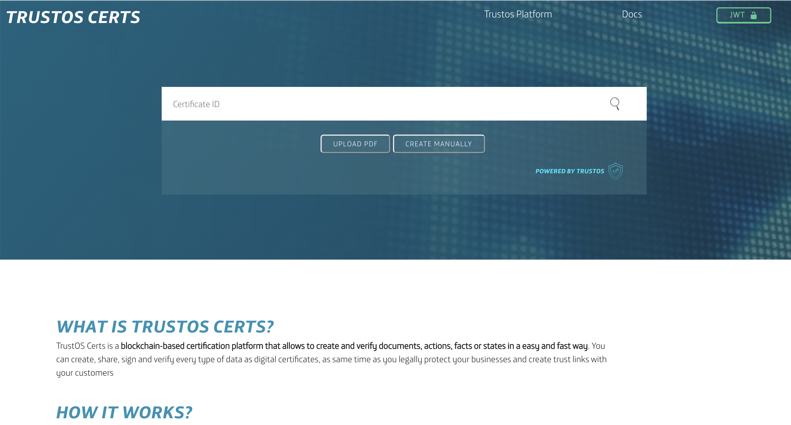
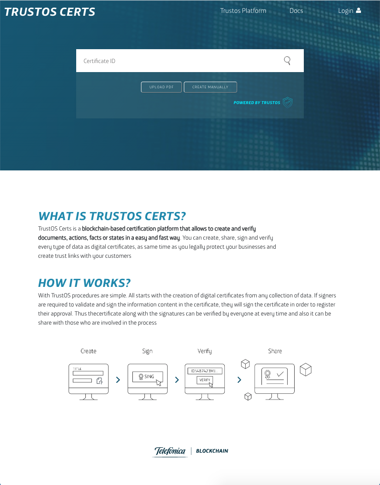

# Demos

In this section you will find snipets of code to make APIs calls to test and see the results for different use case examples. These demo applications allow to understand how easy and fast things are building a new blockchain-based solution or integrating your systems with TrustOS.

## Vaccine tracker
Vaccine Tracker is an easy demo based on Track API that allows us to follow the whole transport process for a vaccine from origin to destination and to monitor constantly critical measures (e.g temperature, humidity)

<details>
  <summary><em><strong>Example JSON structures</strong></em> (Click to expand)</summary>
  <br>

### 1 - Login into the platform
POST - `/login`
```json
{
  "id":"did:vtn:trustid:8297475fa68e64de5128f0b819fae647f128969bad64bf5ad43f1797e5733eb0",
  "password":"test"
}
```
### 2 - Create asset: Vaccine batch
POST - `/asset/create`
```json
{
   "assetId":"Vaccine_batch_001",
   "data":{
      "lab":"BioNTech",
      "date":"2020/12/12",
      "disp":"2020/08/08",
      "batch":"123111",
      "units":"20",
      "description":"ALLE DEMI CV333"
   },
   "metadata":{
      "location":"51.165691, 10.451526",
      "ref":"Marburg, Germany",
      "temperature":"15",
      "humidity":50
   }
}
```
### 3 - Add rules: Temperature and humidity measures
POST - `/asset/{assetId}/rules`
```json
{
   "rules":{
      "value":[
        {
         "param":"temperature",
         "value":"15"
        }
      ],
      "range":[
        {
         "param":"humidity",
         "min":40,
         "max":60
        }
      ]
   }
}
```

### 4 - Update asset (first transport update - Lyon)
POST - `/asset/{assetId}/update`
```json
{   
  "metadata":{
      "location":"45.74846, 4.84671",
      "ref":"Lyon, France",
      "temperature":"15",
      "humidity":50,
      "transportCompany":"UPS",
      "transporter":"David"
   }
}
```

### 5 - Update asset (transport update with TEMPERATURE ALARM - Barcelona)
POST - `/asset/{assetId}/update`
```json
{   
  "metadata":{
      "location":"41.38879, 2.15899",
      "ref":"Barcelona, Spain",
      "temperature":"10",
      "humidity":50,
      "transportCompany":"SEUR",
      "transporter":"Pep"
   }
}
```

### 6 - Update asset (transport update with HUMIDITY ALARM - Zaragoza)
POST - `/asset/{assetId}/update`
```json
{   
  "metadata":{
      "location":"41.65606, -0.87734 ",
      "ref":"Zaragoza, Spain",
      "temperature":"15",
      "humidity":38,
      "transportCompany":"SEUR",
      "transporter":"Pep"
   }
}
```

### 7 - Update asset (last transport update - Madrid)
POST - `/asset/{assetId}/update`
```json
{   
  "metadata":{
      "location":"40.4165, -3.70256 ",
      "ref":"Madrid, Spain",
      "temperature":"15",
      "humidity":50,
      "transportCompany":"SEUR",
      "transporter":"Pep"
   }
}

```
### 8 - Demonstrator
Along the transport process all the information is displayed in the Vaccine Tracker application. You just need to put the identifier of your asset (assetId) to start seeing the whole tracking information. Moreover, the application is connected to a WebSocket channel in order to listen and monitor all the critical measures that are out of the range or value stablished (e.g temperature and humidity). Every new alarm is displayed as a notification.

Endpoint: `/tracker/vaccine`

Input (assetId): <input value="Vaccine_batch_001"></input>


</details><br>
<details>
  <summary><em><strong>Front-end demo</strong></em> (Click to expand)</summary>
  <br>

- Tracking & monitoring view


</details><br>

<details open>
  <summary><em><strong>Video</strong></em> (Click to expand)</summary>
  <br>
  <iframe width="560" height="315" src="https://www.youtube.com/embed/umDStd-JERc" frameborder="0" allow="accelerometer; autoplay; clipboard-write; encrypted-media; gyroscope; picture-in-picture" allowfullscreen></iframe>
</details>
<br>

## TrustOS Certs
TrustOS Certs is a demo that is based on Cert API and provides a platform to certify each document, file or digital process into Blockchain. 
<details>
  <summary><em><strong>Example JSON structures</strong></em> (Click to expand)</summary>
  <br>
  
  ### 1 - Login into the platform
  POST - `/login`
  ```json
  {
    "id":"did:vtn:trustid:8297475fa68e64de5128f0b819fae647f128969bad64bf5ad43f1797e5733eb0",
    "password":"test"
  }
  ```

  ### 2 - Create certificate from a file 
  For this step we are going to use an API request, but also you could use the front-end demo to create the certificate in an easier way.

  POST - `/certificate/content/create`
  ```json
  {
    "name": "Contract Certificate",
    "description": "This certificate is a tamper-proof and veriafable collection of data that represent the Contract stored on Blockchain.",
    "content": {
      "filename":"Contract.pdf",
      "filehash":"c57c7ba270c4e67020a2944324559eb6d292068015647ec0ad112517ec05579e",
      "size":"40kb"
    },
    "public": false,
    "readers": [
      "did:vtn:reader1",
      "did:vtn:reader2"
    ],
    "signers": [
      "did:vtn:external:signer1",
      "did:vtn:trustid:db4c630673b8e8ca269149d6d611a84a20bb010f8db9b773b1a01576d5e5022b"
    ]
  }
  ```

  Now we have a unique and irrevocable `certID` that can be used for the next interactions for this certificate. Remember to copy it because it will be useful for next steps.

  ### 3 - Demonstrator

  Now you can see the certificate in a more beautiful way though the simple demo that we've built. 

  

  <br>

  You just need to put the `certID` (e.g. `95c46d70f26c1e6478f256af14ce91b976a47843f0b7f4cb542c1fb0a60375b1`) to search for the information about the certificate: certificate information, signatures and other evidences.

  <br>  <br>

  
  


  ### 4 - Sign certificate
  To continue the process, the certificate can require one or more signers to validate and sign the certificate. This process can be done in two ways: using TrustID identities or using external identities/certificates. Every signer can only signe once, but will be able read, check and verify the certificate every time needed.
  
  Now first we are simulating a signature from an external identity (`did:vtn:signer1`). The creator of the certificate is the responsable for this action, and it will appear as the "controller" once signed.

  POST - `/certificate/{certID}/sign/external`
  ```json
  {
    "signature": "eyJSosd289ap389fa8uf3u8u4er8912rz...",
    "publicKey": "-----BEGIN PUBLIC KEY----- .... -----END PUBLIC KEY-----",
    "did": "did:vtn:external:signer1"
  }
  ```

  In case the signers were TrustID identities (created with ID API), those signers should login into the TrustOS platform and sign the certificate with their keys custodied by TrustOS. 

  POST - `/login`
  ```json
  {
    "id":"did:vtn:trustid:db4c630673b8e8ca269149d6d611a84a20bb010f8db9b773b1a01576d5e5022b",
    "password":"test"
  }
  ```

  POST - `/certificate/{certID}/sign`


  ### 4 - Register and revoke certificate
  
  In case your process need more transparency, an evidence of the certificate can be register in any of the public blockhain.

  POST - `/certificate/{certID}/register`
  ```json
  {
    "network": "Ethereum"
  }
  ```

  Once the issuer decides the certificate is no longer valid, it can be revoked.
  
  POST - `/certificate/{certID}/revoke`
  

</details><br>
<details>
  <summary><em><strong>Front-end demo</strong></em> (Click to expand)</summary>
  <br>

- Home view



- Certificate creation view


- Certificate verification view


</details>
<br>
