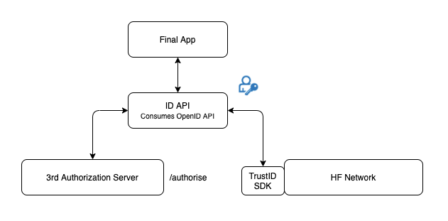
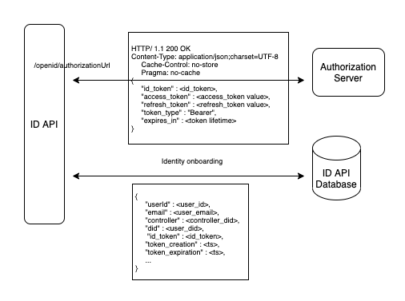

# ID

An abstraction TrustID API implementation. It wraps the functionality of the TrustID SDK in order to offer basic identity management services to users comfortable delegating the responsability of their keys to a custodian. ID API acts as the third-party custodian of the users keys.


## API Specification

The implementation considers that the API is the third-party custodial of
TrustID keys. Currently the keystore is implemented with a FileKeystore,
MongoKeystore comming soon. Private keys from users are stored ciphered
with a passphrase. In order to call every function and unlock the account
the passphrase needs to be provided. The API has the following routes.


### Identity Methods

#### POST   -   `/id/login`
It return a JWT to interact with services authenticated
using JWT using TrustID as identity backend. This functionality is offered
for every user in the system (even those for which we are not the
custodials of the keys). Some services may be still authenticated with JWT,
and we want to support this authentication even of TrustID users.
- `id` :  `<string>` Unique identifier of the user.
- `password`    :  `<string>` Password of the user.

<details>
  <summary><em><strong>Sample structure</strong></em> (Click to expand)</summary>

```
{
  "id": "did:vtn:trustid:ae0213fncasdf234",
  "password": "pass",
}
```
</details><br>

#### POST   -   `/id/refresh`
It refreshes a JWT login.

#### POST   -    `/id/create`
Create a new identity with the key determined in type and a
passphrase to lock the private key.
- `id` :  `<string>` Unique identifier of the user.
- `type`    :  `<string>` Algorithm used, right now only RSA is supported.
- `channel`: `<string>` Identifier of the HF network, only required for admin user.

<details>
  <summary><em><strong>Sample structure</strong></em> (Click to expand)</summary>

```
{
  "password": "passphrase",
  "type": "RSA",
  "channel" "channel1"
}
```
</details><br>

#### POST   -   `/id/get`
Gets the information from a registered identity.
- `id` :  `<string>` Unique identifier to query the identity.

<details>
  <summary><em><strong>Sample structure</strong></em> (Click to expand)</summary>
```
{
  "id": "did:vtn:service:012343",
  "password": "passphrase"
}
```
</details><br>

#### POST   -   `/id/revoke`
Sends a request to revoke a specific identity. You need to be the owner of the identity or its controller to perform this task. 

- `id` :  `<string>` Identity that is going to be revoked. 

<details>
  <summary><em><strong>Sample structure</strong></em> (Click to expand)</summary>

```
{
  "id": "did:vtn:test",
  "password": "passphrase"
}
```
</details><br>


#### POST   -   `/id/verify`
Verification of a registered identity by a controller in the system.

- `id` :  `<string>` Identity that is going to be verified for the user that had been logged.

<details>
  <summary><em><strong>Sample structure</strong></em> (Click to expand)</summary>
```
{
  "id": "did:vtn:test",
  "password": "passphrase"
}
```
</details><br>

#### POST - `/id/update/password`
Updates the old password with a new one.
- `password`: `<string>` New password selected.
- `oldPassword` :  `<string>` Actual password.


<details>
  <summary><em><strong>Sample structure</strong></em> (Click to expand)</summary>

```
{
  "password": "newpass"
  "oldPassword": "test"
}
```
</details><br>

### Identity Recovery Methods

#### POST - `/id/recover/create`
Creates the mechanism to recover the user password. Recovery operation needs an email to send the recovery code in case of password change and a group of custodians, in order to have a social recovery wallet. Each custodian will receive a secret that must be provided when the user wants to recover the password.
- `email`: `<string>` Email that will own the user in order to recover their identity.
- `guardians` :  `<array>` List of guardians.


<details>
  <summary><em><strong>Sample structure</strong></em> (Click to expand)</summary>

```
{
  "guardians": [
    {
      "value": "bob@email.com",
      "type": "email"
    }
  ],
  "email": "alice@email.com"
}
```
</details><br>

(*) Please navigate to the following [section](#internal-mail-service-for-identity-recovery-communications) for details of the mail communication service.


#### POST - `/id/recover/update/email`
Updates the recovery email associated with the identity in order to recover the identity. The email must match with the one registered in /id/recover/create.

- `email`: `<string>` The new user mail.

<details>
  <summary><em><strong>Sample structure</strong></em> (Click to expand)</summary>

```
{
  "email": "john@email.com"
}
```
</details><br>

#### POST - `/id/recover/init`
Initialises the recovery process in order to recover an identity account, the user will receive an email with a sigle use code.

- `email`: `<string>` Email to send the verification code to the user in order to start the account recovery process.


<details>
  <summary><em><strong>Sample structure</strong></em> (Click to expand)</summary>

```
{
  "email": "john@email.com"
}
```
</details><br>

(*) Please navigate to the following [section](#internal-mail-service-for-identity-recovery-communications) for details of the mail communication service.

#### POST - `/id/recover/password`
Finishes the process to recover the password. The params required are the single use code received in the users email and the secrets that were sent to the guardians.
- `code`: `<string>` An single use access code sent to the user mail in /id/recover/init function.
- `guardians`: `<array,objects>` Email of the guardiands and their respective secrets.


<details>
  <summary><em><strong>Sample structure</strong></em> (Click to expand)</summary>

```
{
  "code": "a12f120c912b12e12bd",
  "guardians": [
    {
      "secret": "234895738256",
      "email": "bob@email.com"
    }
  ],
  "newPassword": "testPassword"
}
```
</details><br>

### OpenID Methods
#### GET - `/openId/authorizationUrl`
Gets the OpenID autorization URL to initiate an authentication flow.

<u>*Input*</u>
- `authCallback` :  `<string>` Authorization callback endpoint where identity token is served. It should be the final application.
- `identityProvider` :  `<string>` Identity provider which issues the token. Integration with Google and Microsoft is currently available.

<u>*Output*</u>
- `message`    :  `<json>` An authorization URL to request the identity token.

<details>
  <summary><em><strong>Sample structure</strong></em> (Click to expand)</summary>

```
{
  "message": {
    "authorizationUrl": "https://accounts.google.com/o/oauth2/v2/auth?client_id=3168832523525320-4cb3nmfohpvh3c4p5pstnd6url5k80md.apps.googleusercontent.com&scope=openid%20email%20profile&response_type=code&redirect_uri=http%3A%2F%2Flocalhost%3A9090%2Fopenid%2FauthorizationCallback"
  }
}
```
</details><br>

#### GET - `/openId/authorizationToken`
Gets the autorization token generated for the requesting identity in the JWT standard.

<u>*Input*</u>
- `code` :  `<string>` Authorization code served to the application needed to request the authorization token.

<u>*Output*</u>
- `message`    :  `<string>` The identity token in the JWT standard.

<details>
  <summary><em><strong>Sample structure</strong></em> (Click to expand)</summary>

```
{
  "message": "eyJ0eXAiOiJKV1QiLCJhbGciOiJSUzI1NiIsImtpZCI6ImJXOFpjTWpCQ25KWlMtaWJYNVVRRE5TdHZ4NCJ9.eyJ2ZXIiOiIyLjAiLCJpc3MiOiJodHRwczovL2xvZ2luLm1pY3Jvc29mdG9ubGluZS5jb20vOTE4ODA0MGQtNmM2Ny00YzViLWIxMTItMzZhMzA0YjY2ZGFkL3YyLjAiLCJzdWIiOiJBQUFBQUFBQUFBQUFBQUFBQUFBQUFJQUo5MGVzR3otNnJOazRhQnYySEpRIiwiYXVkIjoiY2FmZjZmNDEtZDZiZS00MjhmLWE5YTUtMDViNDcyNTI5N2RmIiwiZXhwIjoxNjE5MTAwMjQxLCJpYXQiOjE2MTkwMTM1NDEsIm5iZiI6MTYxOTAxMzU0MSwibmFtZSI6ImNlc2FyIFIiLCJwcmVmZXJyZWRfdXNlcm5hbWUiOiJjZXNhcl85M18xMEBob3RtYWlsLmNvbSIsIm9pZCI6IjAwMDAwMDAwLTAwMDAtMDAwMC1lNTgxLTEyZTdhYTIwOTIzYyIsImVtYWlsIjoiY2VzYXJfOTNfMTBAaG90bWFpbC5jb20iLCJ0aWQiOiI5MTg4MDQwZC02YzY3LTRjNWItYjExMi0zNmEzMDRiNjZkYWQiLCJhaW8iOiJEVGxJR2VwT241U3N4ZjlSUEhMWTVZekNQZXMwdU1nYU5CQTN2TFloQUpieldWSWRxd1RlRXhPR25hMDl5MDdHemxub2owbzVCRWNxaFM1VXF3QkFVKlIwWXRzVEkxMU1PUkpRRTYxc1JweFdzeUtjSWZVeXRJQW9QQWgzejVPSXpXSFMxek40RzJLb0d4YWlEWHZXTzYwJCJ8.yhaqvrx9VUmTGJNGTZQYMv-jRIv4OP-sYb4UP4XRADY6FAn7-G5OHj_VHc96yHzPxx-2wxzzrPGF4hxA9T4M5FSuuw4LqrQXT5H7oey27LYAE_gFJ8Uo8xY0fMb3yh8Q6HPbmAEuPjLHi_X6roB1dZR3AZj1OnxQr4_0wZRKpvBOkvX943bJtvMKYdrewVaqlI9JfxsPX89pdGh9zNqkyU6mdqAKt_BeucotUQ-Kbpj9Y_mYzXKiHxMzN_uhM_UtEeY_hbpBf87YrC9Jd9Iv3oBZ3aSTLXHHpN8tRrywRXAG-f23TgldldjTuCIuTXVg2xiGJwo9tIGoH0dRmnUl_Q"
}
```
</details><br>

### Signature methods

#### POST - `/id/sign`
Requests a signature using a key in custody.

*Body*
- `payload` :  `<json>` Payload that needs to be signed.


<details>
  <summary><em><strong>Sample structure</strong></em> (Click to expand)</summary>

```
{
  "payload": {
    "arg1": "test",
    "arg2": "payload"
  }
}
```
</details><br>

#### POST - `/id/validate`
Validates a signature using a key in custody.
- `id`: `<string>` Identifier of the signer.
- `payload` :  `<string>` Payload that needs to be validated.


<details>
  <summary><em><strong>Sample structure</strong></em> (Click to expand)</summary>

```
{
  "id"
  "payload": "eyaqwuqiiqiwiqaqiemasoiaiqiiaskqweioqweiuwe"
}
```
</details><br>


### Services methods
#### POST   -   `/service/create`
Create a new service in the TrustID network.

- `serviceID` :  `<string>` Identity that is going to be verified for the user that had been logged.
- `name` :  `<string>` Name of the service deployed in Hyperledger Fabric.
- `access` :  `<json>` Access policy that will have the service: PUBLIC, SAME_CONTROLLER, FINE_GRAINED.
- `channel` :  `<string>` Identifier of the HF network.

<details>
  <summary><em><strong>Sample structure</strong></em> (Click to expand)</summary>
```
{
  "serviceID":  "track",
  "name": "trackscc",
  "access": {
  	"policy": "PUBLIC"
  },
  "channel": "channel1"
}
```

</details><br>

#### POST   -   `/service/get`
Gets the registered information for a service.
- `serviceID` :  `<string>` Identity that is going to identify the service.

<details>
  <summary><em><strong>Sample structure</strong></em> (Click to expand)</summary>
```
{
  "serivceID": "did:vtn:service:012343",
  "password": "passphrase"
}
```
</details><br>

#### POST   -   `/service/updateAccess`
Updates the access of a service.
- `serviceID` :  `<string>` Identity that is going to identify the service.
- `access` :  `<json>` Access policy that will have the service: PUBLIC, SAME_CONTROLLER, FINE_GRAINED.

The supported policies are the following:
- PUBLIC, everyone with access on the network can call the service.
- SAME_CONTROLLER, identities with the controller that created the service, can call the service.
- FINE_GRAINED, only specific identities can access to the service.

<details>
  <summary><em><strong>Sample structure</strong></em> (Click to expand)</summary>
```
{
  "serviceID":  "did:vtn:service:sacc",
  "access": {
  	"policy": "FINE_GRAINED",
  	"threshold": 0,
  	"access": {
  		"did:vtn:trustid:c0fd6b4749329c4acec7f4ac273d46c2b755736e9f5cae6fc62acec8d04549c6": 2
  	}
  }
}
```
</details><br>

#### POST   -   `/service/update`

Updates the information of a service.
- `serviceID` :  `<string>` Identity that is going to identify the service.
- `name` :  `<string>` Name of the service deployed in Hyperledger Fabric.
- `channel` :  `<string>` Identifier of the HF network.

<details>
  <summary><em><strong>Sample structure</strong></em> (Click to expand)</summary>

```
{
  "serviceID":  "did:vtn:service:sacc",
  "channel": "channel1",
  "name":"sacc-chaincode"
}

```
</details><br>


#### POST   -   `/service/invoke`

Invoke a function from a distributed service using TrustID.

- `serviceID` :  `<string>` Identity that is going to identify the service.
- `function` :  `<string>` Function that is going to be called.
- `args` :  `<string>` Args of the function that is going to be called.

<details>
  <summary><em><strong>Sample structure</strong></em> (Click to expand)</summary>

```
{
  "serviceID": "did:vtn:trustos:123drfw",
  "password": "passphrase",
  "args": [
    "a",
    "b",
    "200"
  ],
  "channel": "channel1",
  "function": "create"
}
```
</details><br>

#### POST   -  `/service/invoke/jsonArgs`
 Invoke a function from a distributed service using TrustID.

- `serviceID` :  `<string>` Identity that is going to identify the service.
- `function` :  `<string>` Function that is going to be called.
- `args` :  `<json>` Args of the function that is going to be called in a json format.


<details>
  <summary><em><strong>Sample structure</strong></em> (Click to expand)</summary>
```
{
  "serviceID": "did:vtn:trustos:123drfw",
  "args": {
    "field": "value"
  },  
  "function": "create"
}
```
</details><br>

#### POST   - `/service/query`
Invoke a function from a distributed service using TrustID.

- `serviceID` :  `<string>` Identity that is going to identify the service.
- `function` :  `<string>` Function that is going to be called.
- `args` :  `<string>` Args of the function that is going to be called.


<details>
  <summary><em><strong>Sample structure</strong></em> (Click to expand)</summary>
```
{
  "serviceID": "did:vtn:trustos:123drfw",
  "args": [ "a"],
  "function": "get"
}
```
</details><br>

#### POST - `/service/query/jsonArgs`
Invoke a function from a distributed service using TrustID.

- `serviceID` :  `<string>` Identity that is going to identify the service.
- `function` :  `<string>` Function that is going to be called.
- `args` :  `<json>` Args of the function that is going to be called in a json format.


<details>
  <summary><em><strong>Sample structure</strong></em> (Click to expand)</summary>
```
{
  "serviceID": "did:vtn:trustos:123drfw",
  "args": {
    "field": "value"
  },  
  "function": "get"
}
```
</details><br>


### Signed Transactions
#### POST - `/signed/id/import`

Import an identity without custody in TrustID. Due to this, each transaction must be signed with the private key in custody by the user.

- `publicKey`: `<string>` The publicKey to verify the signature of the transactions
- `payload`: `<string>` A JWS signed with the private Key.


In order to create the JWS for the payload body, the JSON structure that is needed to be signed is the following:
```
{
   "function":"createSelfIdentity",
   "params":{
      "did":"$id", 
      "publicKey":"$pubkey" 
   }
}
```

<details>
  <summary><em><strong>Sample structure</strong></em> (Click to expand)</summary>
```
{
       "publicKey":  "-----BEGIN PUBLIC KEY-----\r\nMIIBIjANBgkqhkiG9w0BAQEFAAOCAQ8AMIIBCgKCAQEAokZtVnCJ5KnQRmYqV6j3\r\n1Oak7K0X/pBDe/QS+LG1UEwcvi2rzMutvJUouMnLgroTMjErYFq0gVJAq7io2Yo/\r\n1/I0suueWSfU30kNYoVikHgMKrHtWZA1iCR9uzYffeC/KYBi0f+bLB5789+zJvr3\r\n8ScaPu+S0LIoYN7j6b7CqWfTBIfqM8NNxyhPiWsGBykQOB1Gl3VEiivm9dp5vFuS\r\n0OM/pe/+ToA4vHDIpr1NyxV0zM4TzLHbvWV70HMztsXmYp1yW8EQcLd412FOmtkU\r\nkEqqsoNK1IYX6F1ooRUjSGeybxPNKobNwkAQqa4QPMW5eWBiIMvAxs2qVuPclkns\r\nrQIDAQAB\r\n-----END PUBLIC KEY-----\r\n",
       "payload": "eyJjdHkiOiJqd2sranNvbiIsImFsZyI6IlJTMjU2Iiwia2lkIjoidlB2MnhmLUUxcTEyVVhjUmtJMzZBcDU2blpzUktFSWpKYnJvWkRYTENGUSJ9.eyJmdW5jdGlvbiI6ImNyZWF0ZVNlbGZJZGVudGl0eSIsInBhcmFtcyI6eyJkaWQiOiJkaWQ6dnRuOnRydXN0aWQ6YjgwNmYzYmVmOTk2N2Y5MDNkYjk0NjdlYjgwOWViMTM4YzQ4ZDNkMTcxN2VkYTJkNWE2YmIxNzg5NjJhODgxZjIxNjA3NTI3NDgwMTMzIiwicHVibGljS2V5IjoiLS0tLS1CRUdJTiBQVUJMSUMgS0VZLS0tLS1cclxuTUlJQklqQU5CZ2txaGtpRzl3MEJBUUVGQUFPQ0FROEFNSUlCQ2dLQ0FRRUFva1p0Vm5DSjVLblFSbVlxVjZqM1xyXG4xT2FrN0swWC9wQkRlL1FTK0xHMVVFd2N2aTJyek11dHZKVW91TW5MZ"
}
```
</details><br>

#### POST - `/signed/service/invoke`

Write operation to a service signing the transaction with the private key guarded by the user.

- `publicKey`: `<string>` The did to recover the public key
- `payload`: `<string>` A JWS signed with the private key. The payload is the signature of the JSON explained below.

````
{
        "function": "invoke", 
        params: {
            did: "coren-trackscc",  // did of the service
            args: ["createAsset", JSON.stringify(**args**)], // function to call the chaincode and the respective params
            channel: "channel1" // channel where is deployed the chaincode
        }
    }


````

<details>
  <summary><em><strong>Sample structure</strong></em> (Click to expand)</summary>
```
{
  {
       "id":  "did:vtn:trustid:b806f3bef9967f903db9467eb809eb138c48d3d1717eda2d5a6bb178962a881f21606828938366",
       "payload": "eyJjdHkiOiJqd2sranNvbiIsImFsZyI6IlJTMjU2Iiwia2lkIjoidlB2MnhmLUUxcTEyVVhjUmtJMzZBcDU2blpzUktFSWpKYnJvWkRYTENGUSJ9.eyJmdW5jdGlvbiI6ImNyZWF0ZVNlbGZJZGVudGl0eSIsInBhcmFtcyI6eyJkaWQiOiJkaWQ6dnRuOnRydXN0aWQ6YjgwNmYzYmVmOTk2N2Y5MDNkYjk0NjdlYjgwOWViMTM4Yz"
}
```
</details><br>

#### POST -  `/signed/service/query`
Read operation to a service signing the transaction with the private key guarded by the user.


- `publicKey`: `<string>` The did to recover the public key
- `payload`: `<string>` A JWS signed with the private key. The payload is the params explained below.

````
{
        "function": "invoke", 
        params: {
            did: "coren-trackscc",  // did of the service
            args: ["getAsset", JSON.stringify(**args**)], // function to call the chaincode and the respective params
            channel: "channel1" // channel where is deployed the chaincode
        }
    }

````

<details>
  <summary><em><strong>Sample structure</strong></em> (Click to expand)</summary>
```
{
  {
       "id":  "did:vtn:trustid:b806f3bef9967f903db9467eb809eb138c48d3d1717eda2d5a6bb178962a881f21606828938366",
       "payload": "eyJjdHkiOiJqd2sranNvbiIsImFsZyI6IlJTMjU2Iiwia2lkIjoidlB2MnhmLUUxcTEyVVhjUmtJMzZBcDU2blpzUktFSWpKYnJvWkRYTENGUSJ9.eyJmdW5jdGlvbiI6ImNyZWF0ZVNlbGZJZGVudGl0eSIsInBhcmFtcyI6eyJkaWQiOiJkaWQ6dnRuOnRydXN0aWQ6YjgwNmYzYmVmOTk2N2Y5MDNkYjk0NjdlYjgwOWViMTM4Yz"
}
```


</details><br>


---
#### (*) Internal mail service for identity recovery communications

The password recovery process functions require a series of communications via email both to send the one-time code to the user and to send the different secrets to the guardians involved in the process. There are two possibilities for communication.

- TrustOS mail service: TrustOS has a mail service that allows internal communication. In this case, functions generate and send emails automatically to the user and the guardians, eliminating the need to do so externally. The response is shown bellow:

```
{
  "output": "Sent email to user"
}
```


- External communication: If on the contrary, the use case requires external communication, TrustOS just generates the codes and return them in the function response. 
The response for this case is shown below:

```
{
  "output": {
    "guardians": [
{
        "email": "bob@mail.com",
        "secret": "d10ff4ef162ee9fb4cd22ec8a78695520a3ed1ba809hff0495b8abf62d997224"
},
{
        "email": "alice@mail.com",
        "secret": "d10ff4ef162ee9fb4cd22sdjk78695520a3ed1ba809hff0495b8abf62sdm2333"
},
    ]
  }
}

```
To decide the type of communication there is a flag named `internalMailService` sent as a query param in the request. If the flag is set to `true` emails will be sent internally through the TrustOS mail service. On the contrary if it is set to `false` the communication will be managed externally.

The functions that require this flag are:

- POST - `/id/recover/create?internalMailService=true`
- POST - `id/recover/init?internalMailService=true`

## OpenID Connect integration

[OAuth 2.0](https://oauth.net/2/) is the industry-standard protocol for authorization. It is a framework for delegating access authorisation to APIs that allows the reuse of authentication mechanisms so that apps do not have to manage identities.

[OpenId Connect](https://openid.net/connect/) is an identity layer built on top of the OAuth 2.0 protocol and extends it with an authentication layer. Authorization Servers allow to verify the identity of end-users and to obtain certain information associated with their profiles.

TrustID has integration with OpenID Connect enabling the onboarding and use of the TrustOS modules to identities generated in different identity providers such as Google or Microsoft.

### OpenID integration


The OAuth 2.0 flow used by TrustID is Authorization code grant type:
- The application requests the user's express consent to access the data by opening a browser where the user specifies the scopes it wants to access.
- The user sends the access approval to the server through the browser.
- The server gives the user an access code that is redirected to the application.
- The application requests access to the authentication server by sending it the access code obtained in the previous step.
- Finally, the server gives the application the identity token.

TrustID manages the identity token to provide access to TrustOS to the end-users. The identity token is represented by a JWT signed by the Identity Provider (using RS256 algorithm), it is a claim which contains user's information as payload. A payload of an identity token generated by Google is shown below:

```
{
  "iss": "https://accounts.google.com",
  "azp": "316883325320-2il4roboraui8497s0so0vp82d1vo19h.apps.googleusercontent.com",
  "aud": "316883325320-2il4roboraui8497s0so0vp82d1vo19h.apps.googleusercontent.com",
  "sub": "112689420544152116604",
  "email": "bob_hamilton@gmail.com",
  "email_verified": true,
  "at_hash": "p4CHDlrU9yfN3WcGtzp9Uw",
  "name": "Bob",
  "picture": "https://lh4.googleusercontent.com/-5lQ3comXlRU/AAAAAAAAAAI/AAAAAAAAAAA/AMZuuckL7QQpCJckUhD1AaU4lKkWuNq-uw/s96-c/photo.jpg",
  "given_name": "Bob",
  "family_name": "Hamilton",
  "locale": "es",
  "iat": 1613581956,
  "exp": 1613585556
}
```

The first time an identity token arrives, an onboarding flow is triggered. This means that a TrustOS identity is generated for the issued token as it is necessary to generate keys for the user to be able to sign transactions within the platform.

### General OpenID identity onboarding flow


When a request arrives authenticated by an Identity Token, TrustID checks the following:
- The issuer. Should be a recognised Identity Provider.
- The issuer signature. Verified with the public key of the Identity Provider.
- The expiration data. To ensure the token is still valid.
- The presence os a TrustOS identity that represents the user.

If all conditions are satisfied the request is validated, the end-user has access to the requested module and is able to sign transactions.

### OpenID flow details and requirements
When a OpenID flow is initialized, an application callback endpoint should be passed as query parameter. The goal of the endpoint is to receive a code from the authorization server to authenticate the application and request the identity token. Thus, it is mandatory for the endpoint to be in a public domain and you should contact [soporte-bteam@telefonica.com](mailto:usoporte-bteam@telefonica.com) as we need to provision it on the OpenID clients managed by TrustOS. An example is shown below:
```
authCallback = "https://yourapp.com/authCb"
```
When the authorization URL is requested and the callback is received from the Authorization Server, an authorization code is served to the application. At this point the application should call the TrustID authorization token function (/authorizationToken) specifying the authorization code. This function allows the application verification on the authorization server checking its authorization code (passed as query parameter). An example of a request is shown below:
```
/openid/authorizationToken?code=M.R3_BAY.36b026d5-b621-4252-124e-e43a00aeb68b
````
Once the Authorization Server validates the code, it sends the JWT which contains the Identity Token to TrustID and, after the onboarding process, sends it to the final application. From then on, the application can send requests to the TrustOS modules by including the JWT in the authentication header in the following way:
```
bearer JWT
```
The sequence diagram of the process is shown below:


### Resource request flow

The final application should store the user's JWT. If for example it is a web application, it could store it in a session cookie:


<hr>

## Testing the application

In postman folder there are the collection and environment to interact and test with the API methods. It is only needed to import them into postman application and know to use the coren-certapi module

Also you can download the files in the links below:

<a href="_static/idapi.collection.json" download> - Postman collection</a>
<br>
<a href="_static/environment.json" download> - Postman environment</a>