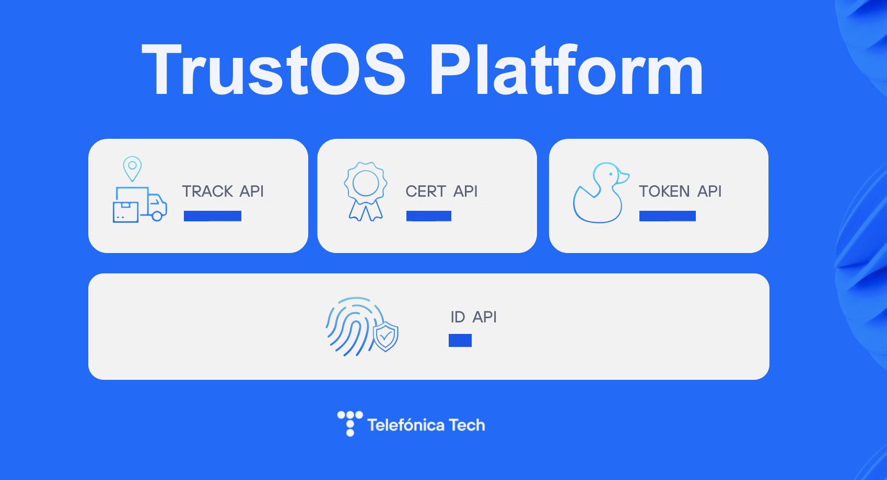

# Modules

## [Track](track.html)

Creation and tracking the life cycle of the assets in the Blockchain. An asset is a digital representation of a real asset in the physical world. Using this module you can record immutable information that uniquely characterizes the asset and update its attributes inherently linked to the instant it was created/updated, so you do not need a trusted third party to certify the existence of that information at any time since you recorded it.

## [Token](token.html)

Creation and management of transferable tokens to build new markets, gamification strategies and easily create transferable value on the network. Applications can issue tokens, transfer them, lock them, etc., keeping at any time an absolute and certain control of the property or rights of use over it. ERC20 and ERC721 standards are implemented to make easier any kind of integration or migration with/from external environments.

## [Cert](cert.html)

Creation, management and sign of digital certificates on blockchain. A certificate is a tamper-proof and verifiable collection of data that represents a process, a file/document, an accomplishment or any activity that can benefit from the inmmutability and authenticity.

## [ID](id.html)

Identity management and decentralised services. Through this module it is possible to create and manage identities. TrustOS acts as the custodian of the identity keys, but it is also possible to operate with external identities and even import them. In addition, it has integration with OpenID to operate with identities generated in the different identity providers.
