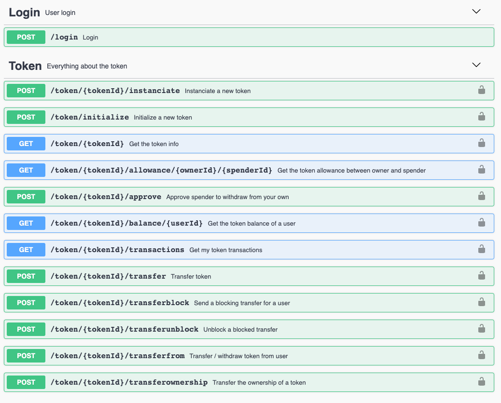

# Token

Token API allows developers to easily create, transfer and get transferable tokens on the Hyperledger Fabric network. Through this API giving transferable value to simple assets can generate new markets and gamification strategies.

## API Specification

An abstraction API with all the token functionalities.

### Token

A token is an asset that gets a transferable value on the blockchain network and can represent whatever it can be imagined, either an abstract or real/physic thing. The term is a little bit confusing at first, since a token can represent the whole class, in which the total supply is declarated, or individual tokens (balances) transferable between users.

Every token has the following structure:
- `name` :  `<string>`  Name of the generic token.
- `symbol` : `<string>` Shortname for the token.
- `owner` :  `id<string>:company<string>`  Token owner. It has to be specified the ID of the owner and the ID of the organization it belongs to inside the organization.
- `ethereumAddress`: `<string>` Address in the Ethereum blockchain, in case we want to link it to a public blockchain token.
- `totalSupply` :  `<integer>` Total number of individual tokens issued.

<details>
  <summary><em><strong>Sample structure</strong></em> (Click to expand)</summary>

```js
{
      "name": "KARMA",
      "symbol": "KRM",
      "owner": "bteam:org1MSP",
      "ethereumAddress": "0x320aty492ua90suf9a0veuf903as3q82",
      "totalSupply": 99999999999999
}
```
</details>
<br>

## API Methods




<details>
  <summary><em><strong>Token methods</strong></em> (Click to expand)</summary>

---

#### POST   -   `/token/create`

Initialize a new token in the network with some specific information.

<u>*Input*</u>
- `name` :  `<string>` Token name.
- `symbol` : `<string>` Token shortname.
- `owner` :  `identifier<string>:company<string>` Token owner contract.
- `ethereumAddress` :  `<string>` This address represents the smart contract in Ethereum associated to the token. At the moment is given as an input, but in future releases it will be created by the chaincode and given to the developer as a response.
- `totalSupply` :  `<integer>`  Total amount of individual tokens that will be created.

<details>
  <summary><em><strong>Sample structure</strong></em> (Click to expand)</summary>

```js

{
  "name": "KARMA",
  "symbol": "KRM",
  "owner": "bteam:org1MSP",
  "ethereumAddress": "0x0",
  "totalSupply": 99999999999999
}

```
</details>
 <br>

<u>*Output*</u>
- `message`    :  `<string>` 

<details>
  <summary><em><strong>Sample structure</strong></em> (Click to expand)</summary>

```js

{
  "output": {
    "name": "KARMA",
    "symbol": "KRM",
    "owner": "bteam:org1MSP",
    "ethereumAddress": "0x0",
    "totalSupply": 99999999999999
  }
}

```
</details>


---

#### GET   -   `/token/{tokenId}`

Gets all the token information.

<u>*Input*</u>
- `tokenId` :  `<string>`  Token identifier..
  
<u>*Output*</u>
- `token`    :  `<string>` 

<details>
  <summary><em><strong>Sample structure</strong></em> (Click to expand)</summary>

```js

{
  "output": {
    "name": "KARMA",
    "symbol": "KRM",
    "owner": "bteam:org1MSP",
    "ethereumAddress": "0x0",
    "totalSupply": 99999999999999
  }
}

```
</details>


---

#### GET   -   `/token/{tokenId}/allowance/{owner}/{spender}`

This call tells if some specific spender is allowed by some owner to performs actions over the token.

<u>*Input*</u>
- `tokenId` :  `<string>`  Token name.
- `ownerId`   :  `<string>`  Token owner.
- `spenderId` :  `<string>`  Person from whom we want to know how much he is allowed to spend.
  
<u>*Output*</u>
- `allowed`  : `<integer>` Quantity of tokens he is allowed to spend.

<details>
  <summary><em><strong>Sample structure</strong></em> (Click to expand)</summary>

```js

{
  "output": {
    "allowed": 230
  }
}
```
</details>


---

#### POST   -   `/token/{tokenId}/approve`
Approve a different spender for a amount of token you own.

<u>*Input*</u>
- `tokenId` :  `<string>`  Token name.
- `spender` :  `<string>` Name of the spender user.
- `value`   :  `<int>`    Amount that is allowed to spend.

<details>
  <summary><em><strong>Sample structure</strong></em> (Click to expand)</summary>

```js
{
  "spender": "Satoshi:org1MSP",
  "value": "20"
}

```
</details>
<br>

<u>*Output*</u>
- `id`    :  `<string>`  Transaction id.
- `message`    :  `<string>`  Message of the approve transaction.


<details>
  <summary><em><strong>Sample structure</strong></em> (Click to expand)</summary>

```js
{
  "output": {
    "id": "eaff9d6d289ca1894cffb4bbx0e540de4f58f69eb067a23efba2b7581c77e398",
    "message": "Approve 230 from bteam:org1MSP to Satoshi:org1MSP"
  }
}

```
</details>


---

#### GET   -   `/token/{tokenId}/balance/{userID}`
Gets the token balance of a user.

<u>*Input*</u>
- `tokenId` :  `<string>`  Token name.
- `userId`  :  `<string>`  User did.
  
<u>*Output*</u>
- `balance`    :  `<integer>`  User's balance.
- `blocked_balance`    :  `<integer>`  User's blocked balance.

<details>
  <summary><em><strong>Sample structure</strong></em> (Click to expand)</summary>

```js

{
  "output": {
    "balance": 950,
    "blocked_balance": 50
  }
}

```
</details>


---

#### GET   -   `/token/{tokenId}/transactions`
Get the token transaction history.

<u>*Input*</u>
- `tokenId` :  `<string>`  Token identifier.
  
<u>*Output*</u>
- `list` :  `<json>`  List of transactions of the token.

<details>
  <summary><em><strong>Sample structure</strong></em> (Click to expand)</summary>

```js

{
  "output": [
    {
      "id": "eaff9d6d289ca4894cffb4bbb0e540de4f58f69eb067a23efba2b7581c77e398",
      "message": "Approve 20 from bteam:org1MSP to Satoshi:org1MSP"
    },
    {
      "id": "5aa6239bb3c45647ab4ffa52759fc1fc981c28f8beb0724765b0c4505fca5a13",
      "message": "Transfer 40 from bteam:org1MSP to Bob:org1MSP"
    },
    {
      "id": "bb7f630b44a42b67abd437d4d9afb0b515fcd4b5794dd8cd6e3bf4f3510c5146",
      "message": "Transfer 40 from bteam:org1MSP to Alice:org1MSP"
    }
  ]
}

```
</details>


---

#### POST   -   `/token/{tokenId}/transfer`
Transfers individual tokens (balances of a token class).

<u>*Input*</u>
- `tokenId` :  `<string>`  Token name.
- `to`      :  `<string>`  Destination user.
- `value`   :  `<string>`  Balance to transfer.

<details>
  <summary><em><strong>Sample structure</strong></em> (Click to expand)</summary>

```js

{
  "to": "Alice:org1MSP",
  "value": "40"
}

```
</details> <br>
  
<u>*Output*</u>
- `id`    :  `<string>`  Transaction id.
- `message`    :  `<string>`  Message of the approve transaction.

<details>
  <summary><em><strong>Sample structure</strong></em> (Click to expand)</summary>

```js
{
  "output": {
    "id": "bb7f630b44a42b67abd437d4d9afb0b515fcd4b5794dd8cd6e3bf4f3510c5146",
    "message": "Transfer 40 from bteam:org1MSP to Alice:org1MSP"
  }
}

```
</details>


---

#### POST   -   `/token/{tokenId}/transferfrom`

Transfer / withdraw from a user. The user has to be approved to spend individual tokens.

<u>*Input*</u>
- `from` :  `<string>`  Person who approves to spend. He has to have a positive balance.
- `to`   :  `<string>`  Destination user of the funds.
- `value`:  `<string>`  Amount of tokens.

<details>
  <summary><em><strong>Sample structure</strong></em> (Click to expand)</summary>

```js
{
  "from": "bteam:org1MSP",
  "to": "Satoshi:org1MSP",
  "value": "20"
}

```
</details><br>

<u>*Output*</u>
- `id`    :  `<string>`  Transaction id.
- `message`    :  `<string>`  Message of the approve transaction.

<details>
  <summary><em><strong>Sample structure</strong></em> (Click to expand)</summary>

```js
{
  "output": {
    "id": "7876322dbfe61fd2c293f63fd148875d36b3d4fbcec6635d55351bfab2e9e713",
    "message": "TransferFrom 20 from bteam:org1MSP to Satoshi:org1MSP"
  }
}
```
</details>

---

#### POST   -   `/token/{tokenId}/transferownership`

Transfer the ownership of a generic token.

<u>*Input*</u>
- `tokenId` :  `<string>`  Token name.
- `to`      :  `<string>`  New owner.

<details>
  <summary><em><strong>Sample structure</strong></em> (Click to expand)</summary>

```js

{
  "to": "Bob:org1MSP",
}

```
</details><br>

<u>*Output*</u>
- `token`  :  `<json>`  Token with updated parameters.

<details>
  <summary><em><strong>Sample structure</strong></em> (Click to expand)</summary>

```js

{
  "output": {
    "ethereumAddress": "0x0",
    "name": "KARMA",
    "owner": "Bob:org1MSP",
    "symbol": "KRM",
    "totalSupply": 99999999999999
  }
}
```
</details>

---

#### POST   -   `/token/{tokenId}/transferblock`

Transfer individual tokens as a blocked balance for a user.

<u>*Input*</u>
- `tokenId` :  `<string>`  Token name.
- `to`      :  `<string>`  Destination user of the blocked funds.
- `value`   :  `<string>`  Amount of tokens to be blocked.

<details>
  <summary><em><strong>Sample structure</strong></em> (Click to expand)</summary>

```js

{
	"to":"Alice:org1MSP",
	"value":"50"
}

```
</details><br>

<u>*Output*</u>
- `blocked_id`    :  `<string>`  Transaction id.
- `id`    :  `<string>`  Transaction id.
- `message`    :  `<string>`  Message of the approve transaction.

<details>
  <summary><em><strong>Sample structure</strong></em> (Click to expand)</summary>

```js
{
  "output": {
    "blocked_id": "7c76500379b86967c04490baa1d25ecc52adfc9df9340d561805b548d8c87e72",
    "id": "7c76500379b86967c04490baa1d25ecc52adfc9df9340d561805b548d8c87e72",
    "message": "Blocking transfer 50 from bteam:org1MSP to Alice:org1MSP"
  }
}
```
</details>


---

#### POST   -   `/token/{tokenId}/transferunblock`

Unblocks a blocked transfer being true equivalent to accept the blocked balance and false equivalent to returning the blocked balance to origin user.

<u>*Input*</u>
- `tokenId`     :  `<string>`  Token name.
- `blocked_id`  :  `<string>`  Id of the blocked transaction.
- `accept`      :  `<string>`  Flag to determine the acceptance or not of the transaction.

<details>
  <summary><em><strong>Sample structure</strong></em> (Click to expand)</summary>

```js

{
  "blocked_id": "b1cdd2e5df1d7565edb2c54ee39c0ab9931ea647d04627062cb52500ee82c0af",
  "accept": "true"
}

```
</details>

<u>*Output*</u>
- `id`    :  `<string>`  Transaction id.
- `message`    :  `<string>`  Message of the approve transaction.

<details>
  <summary><em><strong>Sample structure</strong></em> (Click to expand)</summary>

```js

{
  "output": {
    "id": "e309a55be8b1c842c3aaf475bb7b7b2b759101b09f622fbb5f8dc56aab3d3795",
    "message": "Accepting blocked transaction b1cdd2e5df0d7565bdb2c54ee39c0ab9931ea647d04627062cb52500ee82c0af from bteam:org1MSP and token amount goes to bteam:org1MSP"
  }
}
```
</details>
</details>
<br>


## How we run the application
As you could see in the [Architecture](architecture.html) module, all the applications are running on cloud. Through Kubernetes orchestration system the application deployment, scaling and management is an easy and automated task.

## Testing the Application
In postman folder there are the collection and environment to interact and test with the API methods. It is only needed to import them into postman application and know to use the coren-tokenapi module.

Also you can download the files in the links below:

<a href="_static/tokenapi.collection.json" download> - Postman collection</a>
<br>
<a href="_static/environment.json" download> - Postman environment</a>


## Errors management
  
Token API errors are managed through the following JSON:
```
{
  "error": {
    "code": "HTTP status code",
    "function": "function in which the error was generated",
    "message": "error description"
  }
}
```

<br/>