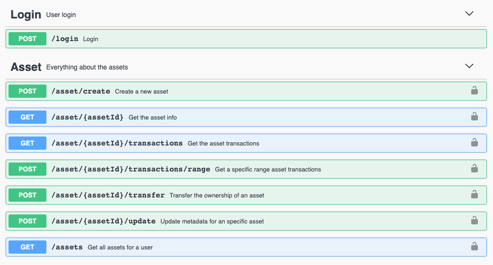

# Track

Track API is used to create, manage, and follow life cycle of **digital assets** on the blockchain. An asset is a digital representation of a real asset in the physical world. Through this API tracking the whole state changes of every asset can be implemented in an easy way, taking advantage of the inherit benefits from blockchain. 

## API Specification

An abstraction API with all the asset functionalities.
### Asset
An asset is a digital representation of a real asset in the physical world. An asset records every single state or data change (f.e. the update of metadata, the transfer of ownership, etc.) This allow us to track the whole transactions since its creation in an inmutable and transparent way.

Every asset has the following structure:

- `assetid` :  `<string>` Unique identifier of the asset 
- `data`    :  `<json>`   JSON of **inmutable** data. Can have as many fields as required by the use case
- `metadata`:  `<json>`   JSON of **mutable** data. Can have as many fields as required by the use case
- `timestamp` :  `<string>` UNIX date of asset creation
- `userOwner`:  `<string>` Owner of the asset
- `hash` :  `<string>` Hash of the asset

<details>
  <summary><em><strong>Sample structure</strong></em> (Click to expand)</summary>

```js
{
    "assetid": "exampleAsset",
    "data": {
      "id":"A2839RP",
      "version":"1"
    },
    "metadata": {
      "color": "red"
      "position": { "x": "53", "y": "22"}
    },
    "timestamp": 1558009289,
    "userOwner": "test:telefonicaMSP",
    "hash": "oCZygxQBp5HBVm+SSUCCrgJfV3+CeghOzV9m+UxDsY8=",
}

```
</details> 
<br>

### Authorised assets

There are two types of assets: owned assets and authorised assets. These last ones, the `authorised assets`  are assets created by other users that have granted you access allowing you to consult and update it. 

In order to interact with both assets in some functions it is necessary to set a flag formely known as `isAuthorised`. In order to interact with authorised, only it is necessary to set the `isAuthorised` flag to `true` as a query parameter in the URL (`...?isAuthorised=true`) as it is shown in the examples below:

- GET  -     `/asset/{assetId}?isAuthorised=boolean`  
- GET  -     `/asset/{assetId}/transactions?isAuthorised=boolean`  
- POST -     `/asset/{assetId}/transactions/range?isAuthorised=boolean`  
- GET  -     `/assets?isAuthorised=boolean`  
- POST -     `/asset/{assetId}/update?isAuthorised=boolean`
- POST -     `​/asset​/{assetId}​/batch​/array?isAuthorised=boolean`
- POST -     `​/asset​/{assetId}​/batch​/range?isAuthorised=boolean`
- POST -     `​/asset​/{assetId}​/batch​/updateArray?isAuthorised=boolean`
- POST -     `​/asset​/{assetId}​/batch​/updateRange?isAuthorised=boolean`
- POST -     `/asset/{assetId}/evidence?isAuthorised=boolean`
- POST -     `/asset/{assetId}/getEvidence?isAuthorised=boolean`
- GET  -     `/asset/{assetId}/getEvidences?isAuthorised=boolean`

To manage your own assets you must set the parameter to false (`...?isAuthorised=false`).

## API Methods



<details>
  <summary><em><strong> Asset methods</strong></em> (Click to expand)</summary>

---

####     POST -  `/asset/create` 
Ceate a digital asset. 

<u>*Input*</u>
- `assetid` :  `<string>` Unique identifier of the asset.
- `data`    :  `<json>` JSON of **inmutable** data. It can have as many field as required.
- `metadata`:  `<json>` JSON of **mutable** data. It can have as many field as required.

<details>
  <summary><em><strong>Sample structure</strong></em> (Click to expand)</summary>

```js
{
    "assetid": "",
    "data": {
      "id":"A2839RP",
      "version":"1"
    },
    "metadata" : {
      "color": "red",
      "position": { "x": 23.34, "y": -24.22}
    }
}
```
</details> 
<br>

<u>*Output*</u>
- `asset`    :  `<json>` 

<details>
  <summary><em><strong>Sample structure</strong></em> (Click to expand)</summary>

```js
{
    "assetid": "exampleAsset",
    "data": {
      "id":"A2839RP",
      "version":"1"
    },
    "metadata": {
      "color": "red"
      "position": { "x": "53", "y": "22"}
    },
    "timestamp": 1558009289,
    "userOwner": "test:telefonicaMSP",
    "hash": "oCZygxQBp5HBVm+SSUCCrgJfV3+CeghOzV9m+UxDsY8=",
}
```
</details> 

---

####    GET     -   `/asset/{assetId}?isAuthorised=boolean`  

Get the asset identified by assetId.

<u>*Input*</u>
- `assetid` :  `<string>` Unique identifier of the asset.
- `isAuthorised`: `<boolean>` Flag to get own or authorised assets.

(*) Please navigate to the following [section](#authorised-assets) for isAuthorised query param details.
  
<u>*Output*</u>
- `asset`    :  `<json>` 

<details>
  <summary><em><strong>Sample structure</strong></em> (Click to expand)</summary>

```js
{
    "assetid": "exampleAsset",
    "data": {
      "id":"A2839RP",
      "version":"1"
    },
    "metadata": {
      "color": "red"
      "position": { "x": "53", "y": "22"}
    },
    "timestamp": 1558009289,
    "userOwner": "test:telefonicaMSP",
    "hash": "oCZygxQBp5HBVm+SSUCCrgJfV3+CeghOzV9m+UxDsY8=",
}
```
</details> 

---

####  POST    `/asset/{assetId}/update?isAuthorised=boolean`  

Updates the **mutable** ("metadata") of an asset.

<u>*Input*</u>

- `assetid` :  `<string>` Unique identifier of the asset.
- `isAuthorised`: `<boolean>` Flag to update own (false) or authorised (true) assets.
- `metadata`:  `<json>` JSON of **mutable** data. It can have as many field as required.

(*) Please navigate to the following [section](#authorised-assets) for isAuthorised query param details.

<details>
  <summary><em><strong>Sample structure</strong></em> (Click to expand)</summary>

```js
{
  "metadata": {
    "color": "blue",
    "position": { "x": 98.35, "y": -12.32}
  }
}
```
</details> 
<br>

<u>*Output*</u>
- `asset`    :  `<json>` 

<details>
  <summary><em><strong>Sample structure</strong></em> (Click to expand)</summary>

```js
{
    "output": {
        "assetId": "test1",
        "data": {
            "color": "yellow",
            "size": "big"
        },
        "metadata": {
            "color": "blue",
            "position": {
                "x": 98.35,
                "y": -12.32
            }
        },
        "timestamp": 1647953653,
        "userOwner": "did:vtn:trustid:ed770703f65656e5b689a047d1cee645b7ad119610a1d31a63f5be0e45c6e0d9",
        "hash": "F5SzRyp4ELhbtcDEsPm8a+2XjyI5w4uoLkAb5yO9C0E="
    }
}
```
</details> 

---

####   GET  -     `/asset/{assetId}/transactions?isAuthorised=boolean`  

Get all transactions for the whole lifecycle of the asset.

<u>*Input*</u>
- `assetid` :  `<string>` Unique identifier of the asset.
- `isAuthorised`: `<boolean>` Flag to get own or authorised assets.

(*) Please navigate to the following [section](#authorised-assets) for isAuthorised query param details.

<u>*Output*</u>
- `asset`    :  `<json>` A list of all transactions.

<details>
  <summary><em><strong>Sample structure</strong></em> (Click to expand)</summary>

```js
{
    "output": {
        "assetId": "test1",
        "data": {
            "color": "yellow",
            "size": "big"
        },
        "transactions": [
            {
                "metadata": {
                    "color": "red",
                    "size": "medium"
                },
                "timestamp": 1647953221,
                "userOwner": "did:vtn:trustid:ed770703f65656e5b689a047d1cee645b7ad119610a1d31a63f5be0e45c6e0d9",
                "hash": "a20Reot68bbYEap+RfN4EmtEbrKoE0UO9rgn205jln0="
            },
            {
                "metadata": {
                    "color": "blue",
                    "size": "big"
                },
                "timestamp": 1647951890,
                "userOwner": "did:vtn:trustid:ed770703f65656e5b689a047d1cee645b7ad119610a1d31a63f5be0e45c6e0d9",
                "hash": "RB/vC1wSwS2hhbttvmtMehWROqmcwlPL9+tkdODLVGI="
            }
        ]
    }
}

```
</details>

---

####   POST  -     `/asset/{assetId}/transactions/range?isAuthorised=boolean`  

Get all transactions within a range for the whole lifecycle of the asset.

<u>*Input*</u>
- `assetid` :  `<string>` Unique identifier of the asset.
- `isAuthorised`: `<boolean>` Flag to get own or authorised assets.
- `rangeAsset`    :  `<json>` JSON object to define range.

(*) Please navigate to the following [section](#authorised-assets) for isAuthorised query param details.

<details>
  <summary><em><strong>Sample structure</strong></em> (Click to expand)</summary>

```js
{
  "init": "0",
  "end": "1575975331"
}
```
</details>
<br>


<u>*Output*</u>
- `asset`    :  `<json>` A list of all transactions.

<details>
  <summary><em><strong>Sample structure</strong></em> (Click to expand)</summary>

```js
{
    "output": {
        "assetId": "test1",
        "data": {
            "color": "yellow",
            "size": "big"
        },
        "transactions": [
            {
                "metadata": {
                    "color": "red",
                    "size": "medium"
                },
                "timestamp": 1647953221,
                "userOwner": "did:vtn:trustid:ed770703f65656e5b689a047d1cee645b7ad119610a1d31a63f5be0e45c6e0d9",
                "hash": "a20Reot68bbYEap+RfN4EmtEbrKoE0UO9rgn205jln0="
            },
            {
                "metadata": {
                    "color": "blue",
                    "size": "big"
                },
                "timestamp": 1647951890,
                "userOwner": "did:vtn:trustid:ed770703f65656e5b689a047d1cee645b7ad119610a1d31a63f5be0e45c6e0d9",
                "hash": "RB/vC1wSwS2hhbttvmtMehWROqmcwlPL9+tkdODLVGI="
            }
        ]
    }
}

```
</details>

---

####   POST     - `/asset/{assetId}/transfer`  

Transfer the ownership of the asset. The user has to be the owner of the asset.

<u>*Input*</u>
- `assetid` :  `<string>` Unique identifier of the asset.
- `destinationId` :  `<string>` The destination owner.

<details>
  <summary><em><strong>Sample structure</strong></em> (Click to expand)</summary>

```js
{
  "destinationId": "bteam",
}
```
</details> 
<br>

<u>*Output*</u>
- `asset`    :  `<json>` 

<details>
  <summary><em><strong>Sample structure</strong></em> (Click to expand)</summary>

```js
{
    "assetid": "exampleAsset",
    "data": {
      "id":"A2839RP",
      "version":"1"
    },
    "metadata": {
      "color": "red"
      "position": { "x": "53", "y": "22"}
    },
    "timestamp": 1558009289,
    "userOwner": "bteam",
    "hash": "oCZygxQBp5HBVm+SSUCCrgJfV3+CeghOzV9m+UxDsY8=",
}
```
</details>

---

####   POST     - `/asset/{assetId}/rules`  

Add rules to monitor asset parameters.

<u>*Input*</u>
- `assetId` :  `<string>` Unique identifier of the asset.
- `rules`:  `<json>` JSON of rules. It can have at least two fields: value & range, to specify a constant value or range of values that has to accomplish a parameter. Every rule (value, range) can contain as many conditions for different parameters as necessary. However it's noted that a use of quite many conditions affects the performance of the asset udpates.

<details>
  <summary><em><strong>Sample structure</strong></em> (Click to expand)</summary>

```js
{
  "rules": {
    "value": [
      {
        "param": "a",
        "value": "b"
      },
      {
        "param": "aa",
        "value": "bb"
      }
    ],
    "range": [
      {
        "param": "b",
        "min": 0,
        "max": 100
      }
    ]
  }
}
```
</details> 
<br>

<u>*Output*</u>
- `rules`    :  `<json>` 

<details>
  <summary><em><strong>Sample structure</strong></em> (Click to expand)</summary>

```js
{
{
  "rules": {
    "value": [
      {
        "param": "a",
        "value": "b"
      },
      {
        "param": "aa",
        "value": "bb"
      }
    ],
    "range": [
      {
        "param": "b",
        "min": 0,
        "max": 100
      }
    ]
  }
}
```
</details>

---

####   POST     - `/asset/{assetId}/authorise`  

Authorise user access for an asset. Only the asset owner can do this.

<u>*Input*</u>
- `assetId` :  `<string>` Unique identifier of the asset.
- `userId` :  `<string>` The authorised user.

<details>
  <summary><em><strong>Sample structure</strong></em> (Click to expand)</summary>

```js
{
  "userId": "did:bteam"
}
```
</details> 
<br>

<u>*Output*</u>
- `asset`    :  `<json>` 

<details>
  <summary><em><strong>Sample structure</strong></em> (Click to expand)</summary>

```js
{
  "output": {
    "message": "Successfully authorised user did:bteam for asset XXXXX",
  }
}
```
</details>

---

####   POST     - `/asset/{assetId}/unauthorise`  

Unauthorise user access for an asset. Only the asset owner can do this.

<u>*Input*</u>
- `assetId` :  `<string>` Unique identifier of the asset.
- `userId` :  `<string>` The unauthorised user.

<details>
  <summary><em><strong>Sample structure</strong></em> (Click to expand)</summary>

```js
{
  "userId": "did:bteam"
}
```
</details>  
<br>

<u>*Output*</u>
- `asset`    :  `<json>` 

<details>
  <summary><em><strong>Sample structure</strong></em> (Click to expand)</summary>

```js
{
  "output": {
    "message": "Successfully unauthorised user did:bteam for asset XXXXX",
  }
}
```
</details>

---

#### GET   -    `/assets?isAuthorised=boolean`  

Get all assets for user

<u>*Input*</u>
- `isAuthorised` :  `<bool>`  Flag to get own or authorised assets.

(*) Please navigate to the following [section](#authorised-assets) for isAuthorised query param details.

<u>*Output*</u>
- `assetList`    :  `<json>` 

<details>
  <summary><em><strong>Sample structure</strong></em> (Click to expand)</summary>

```js
{
  "output": [
    "exampleAsset1",
    "exampleAsset2",
    "exampleAsset3"
  ]
}
```
</details>

---

####   POST     - `/assets/create`  

Creates assets from file

<u>*Input*</u>
- `fileInput` :  `<string>` File from which the asset will be generated.

<u>*Output*</u>
- `output`    :  `<json>` 

<details>
  <summary><em><strong>Sample structure</strong></em> (Click to expand)</summary>

```js
{
  "output": [
    {
      "message": "The asset with assetId x has been created successfully"
    }
  ]
}
```
</details>

---

####   POST     - `/assets/update`  

Updates assets from file

<u>*Input*</u>
- `fileInput` :  `<string>` File from which the asset will be updated.

<u>*Output*</u>
- `output`    :  `<string>` 

<details>
  <summary><em><strong>Sample structure</strong></em> (Click to expand)</summary>

```js
{
  "output": [
    {
      "message": "The asset with assetId x has been updated successfully"
    }
  ]
}
```
</details>

---

####   POST     - `​/asset​/{assetId}​/batch​/array?isAuthorised=boolean`  

Creates batch info for an specific asset. This is a list with the IDs of the assets that will belong to the batch.

<u>*Input*</u>
- `assetid` :  `<string>` Unique identifier of the asset.
- `isAuthorised`: `<boolean>` Flag to get own or authorised assets.
- `batchInfo`: `<json>` Array that will represent the list of the IDs of the assets that will belong to the batch.

<u>*Output*</u>
- `output`    :  `<string>` 

<details>
  <summary><em><strong>Sample structure</strong></em> (Click to expand)</summary>

```js
{
  "output": "Batch stored successfully"
}
```
</details>

---

####   POST     - `​/asset​/{assetId}​/batch​/range?isAuthorised=boolean`  

Creates batch info for an specific asset. This is a range of the IDs of the assets that will belong to the batch.

<u>*Input*</u>
- `assetid` :  `<string>` Unique identifier of the asset.
- `isAuthorised`: `<boolean>` Flag to get own or authorised assets.
- `init` :  `<string>`  Range of the IDs of the assets that will belong to the batch.
- `end` :  `<string>` Range of the IDs of the assets that will belong to the batch.

<u>*Output*</u>
- `output`    :  `<string>` 

<details>
  <summary><em><strong>Sample structure</strong></em> (Click to expand)</summary>

```js
{
  "output": "Batch stored successfully"
}
```
</details>

---

####   POST     - `​/asset​/{assetId}​/batch​/updateArray?isAuthorised=boolean`  

Update batch info for an specific asset. This is a list with the IDs of the assets that will be added to the batch.

<u>*Input*</u>
- `assetid` :  `<string>` Unique identifier of the asset.
- `isAuthorised`: `<boolean>` Flag to get own or authorised assets.
- `batchArray`: `<json>` Array that will represent the list of the IDs of the assets that will be added to the batch.

<u>*Output*</u>
- `output`    :  `<string>` 

<details>
  <summary><em><strong>Sample structure</strong></em> (Click to expand)</summary>

```js
{
  "output": "Batch stored successfully"
}
```
</details>

---

####   POST     - `​/asset​/{assetId}​/batch​/updateRange?isAuthorised=boolean`  

Update batch info for an specific asset. This is a range of the IDs of the assets that will belong to the batch.

<u>*Input*</u>
- `assetid` :  `<string>` Unique identifier of the asset.
- `isAuthorised`: `<boolean>` Flag to get own or authorised assets.
- `init` :  `<string>`  Range of the IDs of the assets that will belong to the batch.
- `end` :  `<string>` Range of the IDs of the assets that will belong to the batch.

<u>*Output*</u>
- `output`    :  `<string>` 

<details>
  <summary><em><strong>Sample structure</strong></em> (Click to expand)</summary>

```js
{
  "output": "Batch stored successfully"
}
```
</details>

---

####   POST     - `/asset/{assetId}/admin/create`  

Creates an admin user that is going to be able to authorise other users. Only the asset owner can do this. There can be more than one admin user and the admin can be admin from different assets of different owners.

<u>*Input*</u>
- `assetId` :  `<string>` Unique identifier of the asset.
- `userId` :  `<string>` The user that is going to manage the asset access.

<details>
  <summary><em><strong>Sample structure</strong></em> (Click to expand)</summary>

```js
{
  "userId": "did:bteam"
}
```
</details>  
<br>

<u>*Output*</u>
- `output`    :  `<string>` 

<details>
  <summary><em><strong>Sample structure</strong></em> (Click to expand)</summary>

```js
{
  "output": "Authorisation has been sucessfully done for asset: example1 and user: did:vtn:trustid:bob"
}
```
</details>

---

####   POST     - `/asset/{assetId}/admin/delete`  

Delete an admin user that is not going to be able to authorise other users. Only the asset owner can do this. 

<u>*Input*</u>
- `assetId` :  `<string>` Unique identifier of the asset.
- `userId` :  `<string>` The user that is going to manage the asset access.

<details>
  <summary><em><strong>Sample structure</strong></em> (Click to expand)</summary>

```js
{
  "userId": "did:bteam"
}
```
</details>  
<br>

<u>*Output*</u>
- `output`    :  `<string>` 

<details>
  <summary><em><strong>Sample structure</strong></em> (Click to expand)</summary>

```js
{
  "output": "Authorisation has been sucessfully done for asset: example1 and user: did:vtn:trustid:bob"
}
```
</details>

---

####   POST     - `/asset/{assetId}/admin/authorise`  

Authorise user access for an asset. Only the asset admin can do this.

<u>*Input*</u>
- `assetId` :  `<string>` Unique identifier of the asset.
- `userId` :  `<string>` The authorised user.
- `ownerId` :  `<string>` The asset's owner.

<details>
  <summary><em><strong>Sample structure</strong></em> (Click to expand)</summary>

```js
{
  "userId": "did:bteam",
  "ownerId": "did:bteam"
}
```
</details> 
<br>

<u>*Output*</u>
- `output`    :  `<string>` 

<details>
  <summary><em><strong>Sample structure</strong></em> (Click to expand)</summary>

```js
{
  "output": "Authorisation has been sucessfully done for asset: example1 and user: did:vtn:trustid:bob"
}
```
</details>

---

####   POST     - `/asset/{assetId}/admin/unauthorise`  

Unauthorise user access for an asset. Only the asset owner can do this.

<u>*Input*</u>
- `assetId` :  `<string>` Unique identifier of the asset.
- `userId` :  `<string>` The unauthorised user.
- `ownerId` :  `<string>` The asset's owner.

<details>
  <summary><em><strong>Sample structure</strong></em> (Click to expand)</summary>

```js
{
  "userId": "did:bteam",
  "ownerId": "did:bteam"

}
```
</details>  
<br>

<u>*Output*</u>
- `output`    :  `<json>` 

<details>
  <summary><em><strong>Sample structure</strong></em> (Click to expand)</summary>

```js
{
  "output": "Authorisation has been sucessfully done for asset: example1 and user: did:vtn:trustid:bob"
}
```
</details>

---

####   POST     - `/asset/{assetId}/evidence?isAuthorised=boolean?networkId=int`  

Create an asset evidence in a public network.

<u>*Input*</u>
- `assetId` :  `<string>` Asset identifier.
- `isAuthorised`: `<boolean>` Flag to get own or authorised assets.
- `networkId` :  `<number>` Network identifier (Ethereum = 1, Besu = 2, Polygon = 3)
- `init` :  `<string>` Transactions low limit to generate a public evidence.
- `end` :  `<string>` Transactions upper limit to generate a public evidence.

<details>
  <summary><em><strong>Sample structure</strong></em> (Click to expand)</summary>

```js
{
  "init": "0",
  "end": "1575975331"
}
```
</details>  
<br>

<u>*Output*</u>
- `evidence`    :  `<json>` 

<details>
  <summary><em><strong>Sample structure</strong></em> (Click to expand)</summary>

```js
{
  "output": {
    "networkId": 1,
    "hash": "Ni7JYQG6GSmlEjWoRj2xrfF6ZVFhqBDPzyjk+o/HB2c=",
    "timestamp": 1647522920,
    "init": 0,
    "end": 1592568489,
    "smartContract": "0x1B646bc6C3465Fa8171F7171097A7d8e37b43D6B",
    "transaction": "0x3d3d63714b62db4f28ef6d46911e864520db0645985dce250a80dc8bf6d35f6f",
    "includedTransactions": [
      {}
    ]
  }
}
```
</details>

---

####   POST     - `/asset/{assetId}/getEvidence?isAuthorised=boolean`  

Get a specific asset evidence from the creation timestamp

<u>*Input*</u>
- `assetId` :  `<string>` Asset identifier.
- `isAuthorised`: `<boolean>` Flag to get own or authorised assets.
- `timestamp` :  `<string>` Timestamp when the public evidence was generated.

<details>
  <summary><em><strong>Sample structure</strong></em> (Click to expand)</summary>

```js
{
  "timestamp": "1575975331"
}
```
</details>  
<br>

<u>*Output*</u>
- `evidence`    :  `<json>` 

<details>
  <summary><em><strong>Sample structure</strong></em> (Click to expand)</summary>

```js
{
  "output": {
    "networkId": 1,
    "hash": "Ni7JYQG6GSmlEjWoRj2xrfF6ZVFhqBDPzyjk+o/HB2c=",
    "timestamp": 1647522920,
    "init": 0,
    "end": 1592568489,
    "smartContract": "0x1B646bc6C3465Fa8171F7171097A7d8e37b43D6B",
    "transaction": "0x3d3d63714b62db4f28ef6d46911e864520db0645985dce250a80dc8bf6d35f6f",
    "includedTransactions": [
      {}
    ]
  }
}
```
</details>

---

####   GET     - `/asset/{assetId}/getEvidences?isAuthorised=boolean`  

Get all asset evidences from public networks.

<u>*Input*</u>
- `assetId` :  `<string>` Asset identifier.
- `isAuthorised`: `<boolean>` Flag to get own or authorised assets.
<br>

<u>*Output*</u>
- `evidences`    :  `<json>` 

<details>
  <summary><em><strong>Sample structure</strong></em> (Click to expand)</summary>

```js
{
  "output": {
    [
      "networkId": 1,
      "hash": "Ni7JYQG6GSmlEjWoRj2xrfF6ZVFhqBDPzyjk+o/HB2c=",
      "timestamp": 1647522920,
      "init": 0,
      "end": 1592568489,
      "smartContract": "0x1B646bc6C3465Fa8171F7171097A7d8e37b43D6B",
      "transaction": "0x3d3d63714b62db4f28ef6d46911e864520db0645985dce250a80dc8bf6d35f6f",
      "includedTransactions": [
        {}
      ]
    ],
    [
      "networkId": 2,
      "hash": "Ni7JYQG6GSmlEjWoRj2xrfF6ZVFhqBDPzyjk+o/HB2c=",
      "timestamp": 1647522922,
      "init": 0,
      "end": 1592568489,
      "smartContract": "0x1B646bc6C3465Fa8171F7171097A7d8e37b43D6B",
      "transaction": "0x3d3d63714b62db4f28ef6d46911e864520db0645985dce250a80dc8bf6d35f6f",
      "includedTransactions": [
        {}
      ]
    ]
  }
}
```
</details>

--- 

## How we run the application
As you could see in the [Architecture](architecture.html) module, all the applications are running on cloud. Through Kubernetes orchestration system the application deployment, scaling and management is an easy and automated task.

## Testing the Application
In postman folder there are the collection and environment to interact and test with the API methods. It is only needed to import them into postman application and know to use the coren-trackapi module.

Also you can download the files in the links below:

<a href="_static/trackapi.collection.json" download> - Postman collection</a>
<br>
<a href="_static/environment.json" download> - Postman environment</a>

## Errors management
  
Track API errors are managed through the following JSON:
```
{
  "error": {
    "code": "HTTP status code",
    "function": "function in which the error was generated",
    "message": "error description"
  }
}
```

<br/>