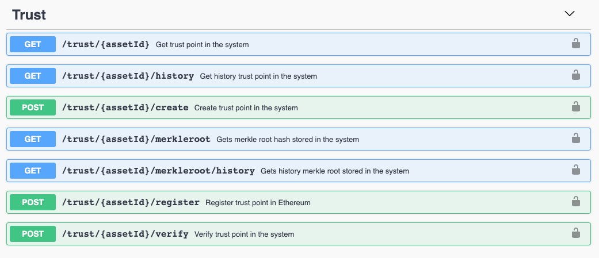

# Trust

This API is used to create and register trust points on the private and public blockchain and verify the integrity of all the encapsulated data.

## API Specification

An abstraction API with all the asset functionalities.

### Trust Point
A trust point is `<JSON>` object used to export the integrity of the transactions over an asset in a private blockchain such as Hyperledger Fabric, to public blockchains such as Ethereum, in order to provide an extra layer of security.


This is the structure of a trust point:

- `assetid` :  `<string>` Identifier of the asset for which the trust point is made.
- `init` :  `<integer>` Timestamp for the previous trust point.
- `end` :  `<integer>` Timestamp at which this trust point is made.
- `txRoot` :  `<string>` Hash of all transactions in the interval.
- `hfTxId` :  `<string>` Current trust point transaction in Hyperledger Fabric.
- `prevHfTxId` :  `<string>`  Previous trust point transaction in Hyperledger Fabric.
- `prevHash` :  `<string>` Hash of the previous trust point.
- `contractAddress` :  `<string>` The smart contract in public network to manage trust points.
- `hash` :  `<string>`  Hash of the trust point (as a JSON) to verify integrity.

<details>
  <summary><em><strong>Sample structure</strong></em> (Click to expand)</summary>

```js
{
  "output": {
    "assetid": "exampleAsset",
    "init": 0,
    "end": 1557830077,
    "txRoot": "DGjUiCplVGom99o6bbdIXAIEqNKgVoQGi7rFNwDX+to=",
    "hfTxId": "671e8c065add74a4759167b9f38cf67916f0f26b5e9b1861c2abcb08a57f8a97",
    "prevHfTxId": "0",
    "prevHash": "0",
    "contractAddress": "0xeE83b6D6dc84fa0c91A6f99971f6CF29F6B7ea3b",
    "hash": "3P1HZ+pvbwhogR3tgKng7cWTk6uaHynGKvjqPjpISi0="

  }
}

```
</details>
<br>

## API Methods



<details>
  <summary><em><strong>Trust methods</strong></em> (Click to expand)</summary>

---

#### GET  -   `/trust/assetId`  

Gets the last trust point in the system for a specific asset.

<u>*Input*</u>
- `assetid` :  `<string>` Identifier of the asset for which the trust point is made.
  
<u>*Output*</u>
- `trustpoint`    :  `<json>`

<details>
  <summary><em><strong>Sample structure</strong></em> (Click to expand)</summary>

```js
{
  "output": {
      "assetId": "exampleAsset",
      "end": 1567601354,
      "contractAddress": "0x1B646bc6C3465Fa8171F7171097A7d8e37b43D6B",
      "hash": "7KYLJXcjGA67WD0v95UvoVPk+sj9M8FdpecS5mRz3+s=",
      "hfTxId": "5c709f206555dbc6a40e37e96aa007a471f706927c8581fb91aef3625413e234",
      "init": 1567594895,
      "prevHash": "Ni7JYQG6GSmlEjWoRj2xrfF6ZVFhqBDPzyjk+o/HB2c=",
      "prevHfTxId": "70c26cfc9aeef3c094b82278b7ed413255f07711366ac2a9da8de7e66b9e53ee",
      "txRoot": "TBSNvFDt3tGDhI5I48IRlBh2l+O0X+kjBq7/96Zk/wI=",
      "public": true,
      "networkId": 1
    }
}

```
</details>

---

#### GET  -   `/trust/assetId/history`  

Gets all trust point history in the system for a specific asset.

<u>*Input*</u>
- `assetid` :  `<string>` Identifier of the asset for which the trust point is made.
  
<u>*Output*</u>
- `trustpoint`    :  `<json>`

<details>
  <summary><em><strong>Sample structure</strong></em> (Click to expand)</summary>

```js
[{
  "output": [
    {
      "assetId": "exampleAsset",
      "end": 1567594895,
      "contractAddress": "0x1B646bc6C3465Fa8171F7171097A7d8e37b43D6B",
      "hash": "Ni7JYQG6GSmlEjWoRj2xrfF6ZVFhqBDPzyjk+o/HB2c=",
      "hfTxId": "70c26cfc9aeef3c094b82278b7ed413255f07711366ac2a9da8de7e66b9e53ee",
      "init": 0,
      "prevHfTxId": "0",
      "txRoot": "oGFYgnxCcPvpa2d6G4vHLs92HQgY2z6S8uwIVM0Qg44=",
      "public": true,
      "networkId": 1
    },
    {
      "assetId": "exampleAsset",
      "end": 1567601354,
      "contractAddress": "0x1B646bc6C3465Fa8171F7171097A7d8e37b43D6B",
      "hash": "7KYLJXcjGA67WD0v95UvoVPk+sj9M8FdpecS5mRz3+s=",
      "hfTxId": "5c709f206555dbc6a40e37e96aa007a471f706927c8581fb91aef3625413e234",
      "init": 1567594895,
      "prevHash": "Ni7JYQG6GSmlEjWoRj2xrfF6ZVFhqBDPzyjk+o/HB2c=",
      "prevHfTxId": "70c26cfc9aeef3c094b82278b7ed413255f07711366ac2a9da8de7e66b9e53ee",
      "txRoot": "TBSNvFDt3tGDhI5I48IRlBh2l+O0X+kjBq7/96Zk/wI=",
      "public": true,
      "networkId": 2
    }
  ]
]

```
</details>

---


#### POST -  `/trust/assetId/create?networkId=integer`  

Creates a trust point in the system for a specific asset.

<u>*Input*</u>
- `assetid` :  `<string>` Identifier of the asset for which the trust point is made.
- `networkId`: `<integer>` Flag to identify the public network on which the trustpoint will be registered. Currently, Ethereum (networkId=1) and Hyperledger Besu (networkId=2) are available.
- `metadata`:  `<json>` JSON of extra data. It can have as many field as required. If you do not want to enter extra data, you must specify the empty JSON in the following way:

<details>
  <summary><em><strong>Sample structure</strong></em> (Click to expand)</summary>

```js
{
  "metadata": {}
}
```
</details>
  
<u>*Output*</u>
- `trustpoint`    :  `<json>` 

<details>
  <summary><em><strong>Sample structure</strong></em> (Click to expand)</summary>

```js
{
  "output": {
      "assetId": "exampleAsset",
      "end": 1567601354,
      "contractAddress": "0x1B646bc6C3465Fa8171F7171097A7d8e37b43D6B",
      "hash": "7KYLJXcjGA67WD0v95UvoVPk+sj9M8FdpecS5mRz3+s=",
      "hfTxId": "5c709f206555dbc6a40e37e96aa007a471f706927c8581fb91aef3625413e234",
      "init": 1567594895,
      "prevHash": "Ni7JYQG6GSmlEjWoRj2xrfF6ZVFhqBDPzyjk+o/HB2c=",
      "prevHfTxId": "70c26cfc9aeef3c094b82278b7ed413255f07711366ac2a9da8de7e66b9e53ee",
      "txRoot": "TBSNvFDt3tGDhI5I48IRlBh2l+O0X+kjBq7/96Zk/wI=",
      "public": true,
      "networkId": 1
    }
}

```
</details>

---

#### GET  -   `/trust/{assetId}/merkleroot`  

Gets the last trust merkle root stored in the system.

<u>*Input*</u>
- `assetid` :  `<string>` Identifier of the asset for which the trust root is stored.
  
<u>*Output*</u>
- `trustroot`    :  `<json>`

<details>
  <summary><em><strong>Sample structure</strong></em> (Click to expand)</summary>

```js
{
  "output": {
    "timestamp": 1567601354,
    "trustHash": "7KYLJXcjGA67WD0v95UvoVPk+sj9M8FdpecS5mRz3+s=",
    "trustRoot": "/unY4B8YDNq/+mdO1iL/Ztng+gbxBput2qnjG+LGMqU="
  }
}

```
</details>

---

#### GET  -   `/trust/{assetId}/merkleroot/history`  

Gets the trust merkle root history stored in the system.

<u>*Input*</u>
- `assetid` :  `<string>` Identifier of the asset for which the trust root is stored.
  
<u>*Output*</u>
- `trustroot`    :  `<json>`

<details>
  <summary><em><strong>Sample structure</strong></em> (Click to expand)</summary>

```js
{
  "output": [
    {
      "timestamp": 1567594895,
      "trustHash": "Ni7JYQG6GSmlEjWoRj2xrfF6ZVFhqBDPzyjk+o/HB2c=",
      "trustRoot": "Vz3ZFr+wTOt0FNbcfhEr+Ziy/Y/jsfNGz693KcqYa5E="
    },
    {
      "timestamp": 1567601354,
      "trustHash": "7KYLJXcjGA67WD0v95UvoVPk+sj9M8FdpecS5mRz3+s=",
      "trustRoot": "/unY4B8YDNq/+mdO1iL/Ztng+gbxBput2qnjG+LGMqU="
    }
  ]
}

```
</details>

---

#### POST -  `/trust/assetId/register?networkId=integer`  

If the trust point does not exists, this method creates and registers it in a public network. If the trust point already exists is just registered.

<u>*Input*</u>
- `assetid` :  `<string>` Identifier of the asset for which the trust point is made.
- `networkId`: `<integer>` Flag to identify the public network on which the trustpoint will be registered. Currently, Ethereum (networkId=1) and Hyperledger Besu (networkId=2) are available.
- `metadata`:  `<json>` JSON of extra data. It can have as many field as required. If you do not want to enter extra data, you must specify the empty JSON in the following way:

<details>
  <summary><em><strong>Sample structure</strong></em> (Click to expand)</summary>

```js
{
  "metadata": {}
}
```
</details>
  
<u>*Output*</u>
- `trustpoint` :  `<json>` 

<details>
  <summary><em><strong>Sample structure</strong></em> (Click to expand)</summary>

```js
{
  "output":  {
      "assetId": "exampleAsset",
      "end": 1567601354,
      "contractAddress": "0x1B646bc6C3465Fa8171F7171097A7d8e37b43D6B",
      "hash": "7KYLJXcjGA67WD0v95UvoVPk+sj9M8FdpecS5mRz3+s=",
      "hfTxId": "5c709f206555dbc6a40e37e96aa007a471f706927c8581fb91aef3625413e234",
      "init": 1567594895,
      "prevHash": "Ni7JYQG6GSmlEjWoRj2xrfF6ZVFhqBDPzyjk+o/HB2c=",
      "prevHfTxId": "70c26cfc9aeef3c094b82278b7ed413255f07711366ac2a9da8de7e66b9e53ee",
      "txRoot": "TBSNvFDt3tGDhI5I48IRlBh2l+O0X+kjBq7/96Zk/wI=",
      "public": true,
      "networkId": 1
    }
}

```
</details>

---

#### POST   -   `/trust/assetId/verify`

Verifies a trust point.

<u>*Input*</u>
- `assetid` :  `<string>` Identifier of the asset for which the trust point is made.
- `timestamp` : `<string>` Timestamp at which this trust point is made.

<details>
  <summary><em><strong>Sample structure</strong></em> (Click to expand)</summary>

```js
{
  "timestamp": "1559822594",
}

```
</details>

<u>*Output*</u>
- `ethereum`:  `<json>` Ethereum info.
  - `trustRoot`:  `<string>` Trust points merkle root registered on Ethereum.
  - `lastEthTxId`:  `<string>` Last transaction for the trust point in Ethereum.
  - `smartContractAddres`:  `<string>` The smart contract in Ethereum to manage trust points .
  - `verified`:  `<bool>` Boolean value to specify if the trust point is registered in Ethereum.
- `hf`:  `<json>` Hyperledger Fabric info.
  - `trustRoot`:  `<string>` Trust points merkle root stored in HF.
  - `timestamp`:  `<string>` Timestamp at which this trust point is made.
  - `verified`:  `<bool>` Boolean value to specify if the trust point is registered in Ethereum and it is has not been modified.


<details>
  <summary><em><strong>Sample structure</strong></em> (Click to expand)</summary>

```js

{
  "output": {
    "ethereum": {
      "lastEthTxId": "0x8ad8f928c261a5b7f2b6515320dfffe1f9f923b17c5e07f6f733f43703f95f87",
      "smartContractAddres": "0x1B646bc6C3465Fa8171F7171097A7d8e37b43D6B",
      "trustHash": "NGz693K+cqYasFNbcfhEr+Ziy/Y/jsfOt0FNKcqYa5E=",
      "trustRoot": "/unY4B8YDNq/+mdO1iL/Ztng+gbxBput2qnjG+LGMqU=",
      "verified": true
    },
    "hf": {
      "timestamp": 1567601354,
      "trustHash": "NGz693K+cqYasFNbcfhEr+Ziy/Y/jsfOt0FNKcqYa5E=",
      "trustRoot": "/unY4B8YDNq/+mdO1iL/Ztng+gbxBput2qnjG+LGMqU=",
      "verified": true
    }
  }
}

```
</details>
</details>
<br>

### MerkleRoot

In order to achieve the integrity and inmutability of all trust points, every time a trust point is create a parallel process is executed. This process consist of the building of a trust-based merkle tree. All the trust points created until that moment are the leaves of the tree that generates a unique merkle root. That merkle root, called as trustRoot, is registered in HF as well as in Ethereum to proof the integrity. So, every time a new trust point is created, a new trustRoot is created too, and it could be registered in Ethereum or not, depends of the user neccessity.


This is the structure registered in HF and Ethereum, once the trust merkle tree is calculated:

- `timestamp` :  `<integer>` Timestamp at which the related trust point is made.
- `trustHash` :  `<string>` Hash of the last trust point included to verify integrity.
- `trustRoot` :  `<string>` Root of the trust merkle tree calculated with all the trust points until that moment.

<details>
  <summary><em><strong>Sample structure</strong></em> (Click to expand)</summary>

```js
{
  "output": {
    "timestamp": 1567601354,
    "trustHash": "7KYLJXcjGA67WD0v95UvoVPk+sj9M8FdpecS5mRz3+s=",
    "trustRoot": "/unY4B8YDNq/+mdO1iL/Ztng+gbxBput2qnjG+LGMqU="
  }
}

```
</details>
<br>


## How we run the application
As you could see in the [Architecture](architecture.html) module, all the applications are running on cloud. Through Kubernetes orchestration system the application deployment, scaling and management is an easy and automated task.


## Testing the Application
In postman folder there are the related collection and environment to interact and test with the API methods. It is only needed to import them into postman application and know to use the coren-trustapi module.

Also you can download the files in the links below:

<a href="_static/trustapi.collection.json" download> - Postman collection</a>
<br>
<a href="_static/environment.json" download> - Postman environment</a>

## Errors management
  
Trust API errors are managed through the following JSON:
```
{
  "error": {
    "code": "HTTP status code",
    "function": "function in which the error was generated",
    "message": "error description"
  }
}
```

<br/>